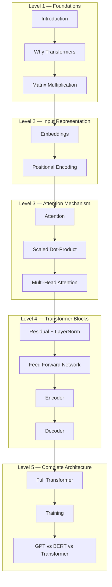

<div align="center">

# Transformers From First Principles

### A Complete Mathematical Implementation of the Transformer Architecture Using Only NumPy

<p>
  <b>No PyTorch.</b> •
  <b>No TensorFlow.</b> •
  <b>No Hidden Abstractions.</b><br>
  Just Mathematics → NumPy → Transformer.
</p>

---


</div>

---

**Transformers From First Principles** is an educational repository that explains the complete Transformer architecture by implementing every major component from scratch using **only NumPy**.

Unlike most repositories that rely on deep learning frameworks, this project focuses on **how Transformers actually work internally**, translating the mathematical equations directly into NumPy code.

Whether you're a student, researcher, or ML enthusiast, this repository is designed to help you understand the mechanics behind modern Transformer models.

---

# Why This Repository?

Most tutorials teach **how to use** Transformers.

Very few teach **how they work**.

This repository bridges that gap by providing:

- Beginner-friendly documentation
- Mathematical derivations with equations
- Pure NumPy implementation
- Complete Encoder & Decoder implementation
- Manual forward and backward propagation
- Structured learning roadmap
- Visual explanations with diagrams
- Modular and easy-to-follow source code

---

# Repository Goals

This project aims to help readers:

- Understand every component of the Transformer architecture.
- Translate mathematical equations into NumPy code.
- Learn how forward and backward propagation work internally.
- Explore Encoder, Decoder, and Attention mechanisms.
- Gain intuition behind modern Large Language Models.

---

# Learning Roadmap



---

# Repository Structure

- [docs/](docs/)
- [pics/](pics/)
- [src/](src/)
- [README.md](README.md)
- [REPOSITORY_GUIDE.md](REPOSITORY_GUIDE.md)
- [ROADMAP.md](ROADMAP.md)
- [CONTRIBUTION.md](CONTRIBUTION.md)
- [requirements.txt](requirements.txt)

A complete explanation of every file is available in :

 **[REPOSITORY_GUIDE.md](REPOSITORY_GUIDE.md)**

---

# Documentation

The documentation gradually builds your understanding of the Transformer architecture from basic concepts to the complete model.

Topics include:

- Introduction
- Why Transformers
- Matrix Multiplication
- Embeddings
- Positional Encoding
- Attention
- Scaled Dot-Product Attention
- Multi-Head Attention
- Residual Connections & LayerNorm
- Feed Forward Network
- Encoder
- Decoder
- Full Transformer
- Training
- GPT vs BERT vs Transformer

---

# Source Code

The implementation is organized into modular components.
- [layers/](src/layers/)

Basic neural network layers implemented using NumPy.

- Linear Layer
- Embedding Layer
- Layer Normalization
- Positional Encoding
- Softmax
- ReLU

- [attention/](src/attention/)

Attention mechanisms.

- Self Attention
- Multi Head Attention
- Masked Attention
- Cross Attention
- Scaled Dot Product Attention

- [encoder/](src/encoder/)

Complete Encoder implementation.

- [decoder/](src/decoder/)

Complete Decoder implementation.

- [transformer.py](src/transformer.py)

Complete Encoder–Decoder Transformer architecture.

---

# Quick Start

Clone the repository

```bash
git clone https://github.com/KARTHIK1749/transformers-from-first-principles.git
```

Move into the project

```bash
cd transformers-from-first-principles
```

Install dependencies

```bash
pip install -r requirements.txt
```

---

# Who Is This Repository For?

This repository is intended for:

- Students learning Deep Learning
- Machine Learning enthusiasts
- AI Researchers
- Interview preparation
- Anyone curious about Transformer internals
- Developers who want to understand what happens under the hood of modern frameworks

---

# Roadmap

Current progress can be found in :

 **[ROADMAP.md](ROADMAP.md)**

Upcoming improvements include:

- Vision Transformer (ViT)
- Rotary Positional Embeddings (RoPE)
- Flash Attention
- KV Cache
- Tiny GPT implementation
- Additional worked mathematical examples

---

#  Contributing

### **Contributions are always welcome!**

If you'd like to improve the repository, fix bugs, enhance documentation, or add educational examples, please read

**[CONTRIBUTION.md](CONTRIBUTION.md)**

before opening a Pull Request.

---


#  Author

### **Karthik Panuganti**


### Connect with me

- **GitHub:** https://github.com/KARTHIK1749
- **LinkedIn:** https://www.linkedin.com/in/karthik-panuganti666

If you have suggestions, spot an issue, or simply want to discuss AI, feel free to open an issue or connect with me.

---

<div align="center">

### ⭐ If this repository helped you learn something new, consider giving it a Star!

*"The best way to truly understand a concept is to build it from scratch."*

</div>