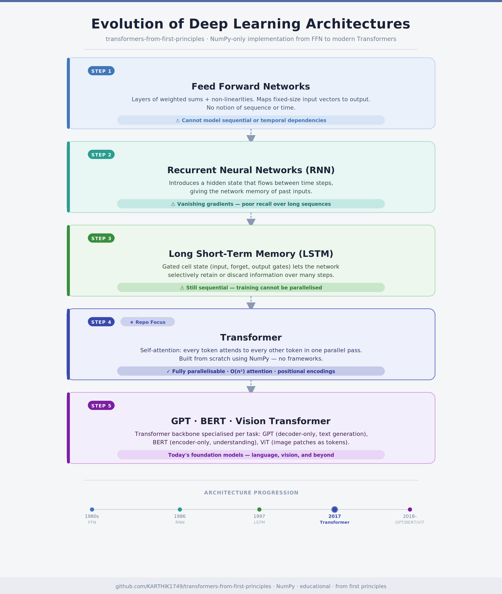

# Transformers from First Principles

> **Learn, Build, and Understand Transformers from Scratch using only NumPy.**

---

# Welcome

Welcome to **Transformers from First Principles**!

This repository is designed to help students, developers, and machine learning enthusiasts understand one of the most influential architectures in modern Artificial Intelligence—the **Transformer**.

Unlike many tutorials that jump directly into frameworks like PyTorch or TensorFlow, this repository focuses on understanding the **fundamental mathematics**, **intuition**, and **implementation details** behind every component of a Transformer.

By the end of this repository, you won't just know **how to use** Transformers—you'll understand **how they are built from scratch**.

---

# Why this Repository?

Most Transformer tutorials fall into one of two categories:

- Heavy mathematical derivations with little implementation.
- Framework-specific implementations with little explanation.

This repository bridges that gap.

Every concept is explained using:

- Intuition
- Mathematical derivations
- Numerical examples
- Pure NumPy implementation
- Visual diagrams

---

## EVOLUTION OF DEEP LEARNING ARCHITECTURES




---

# Repository Objectives

Throughout this repository, we will build every important component of a Transformer, including:

- Token Embeddings
- Positional Encoding
- Self-Attention
- Scaled Dot-Product Attention
- Multi-Head Attention
- Feed Forward Networks
- Layer Normalization
- Residual Connections
- Encoder Stack
- Decoder Stack
- Complete Transformer
- Training Pipeline

Every component will be implemented using **only NumPy**.

No PyTorch.

No TensorFlow.

No JAX.

---

# What You Will Learn

By the end of this repository, you will be able to:

- Explain why Transformers were invented.

- Understand the mathematics behind Self-Attention.

- Build the Encoder stack.

- Build the Decoder stack.

- Implement a complete Transformer.

- Understand GPT, BERT, and Encoder-Decoder models.

- Train a miniature Transformer using NumPy.

---

# Repository Structure

```
docs/
│
├── Theory
├── Mathematics
├── Numerical Examples
└── Visual Explanations

src/
│
├── NumPy Implementations
└── Complete Transformer

examples/
│
└── Hands-on Demonstrations

tests/
│
└── Unit Tests
```

---

# Prerequisites

You do **not** need prior knowledge of Transformers.

However, basic familiarity with the following topics will be helpful:

- Python Programming
- NumPy
- Linear Algebra
- Calculus (basic derivatives)
- Probability

Don't worry if you're not comfortable with every topic—we will explain the required concepts along the way.

---

# Learning Philosophy

This repository follows one simple principle:

> **Never use a concept before explaining it.**

Every equation will be derived.

Every line of code will be explained.

Every architectural decision will have a reason.

Our goal is not just to build a Transformer—but to understand why every component exists.

---

# What's Next?

Before understanding Transformers, we first need to answer an important question:

> **Why were Transformers invented in the first place?**

The next chapter explores the limitations of RNNs and LSTMs and explains how the Transformer architecture changed modern deep learning.

➡ Continue to **01_Why_Transformers.md**