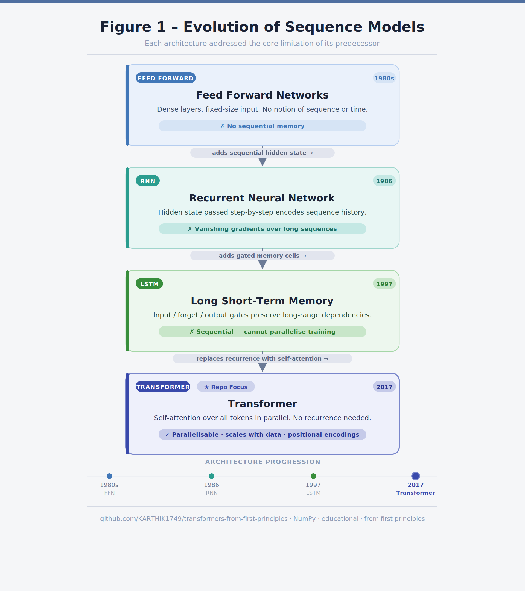
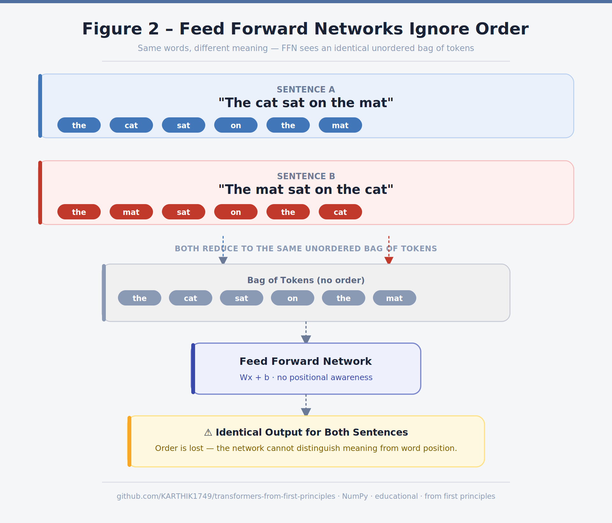
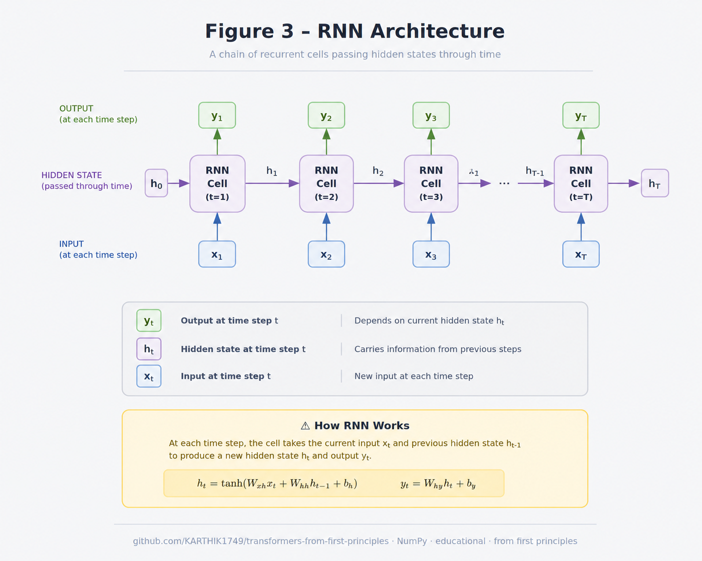
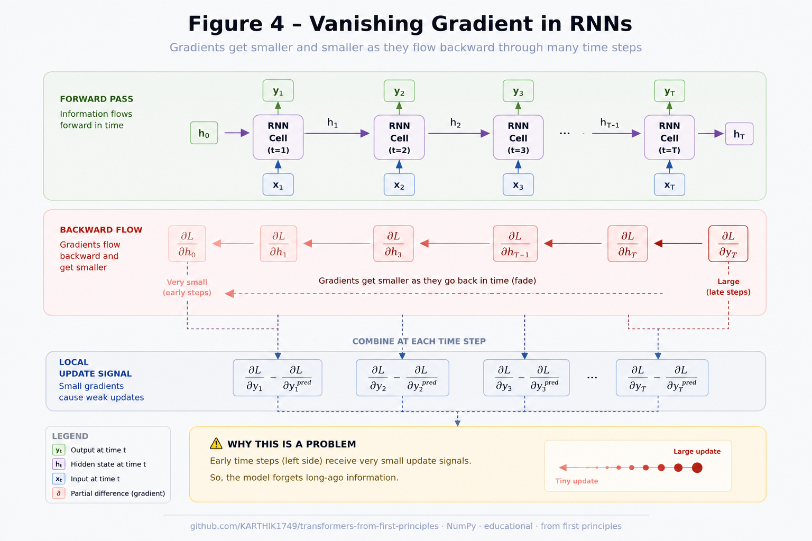
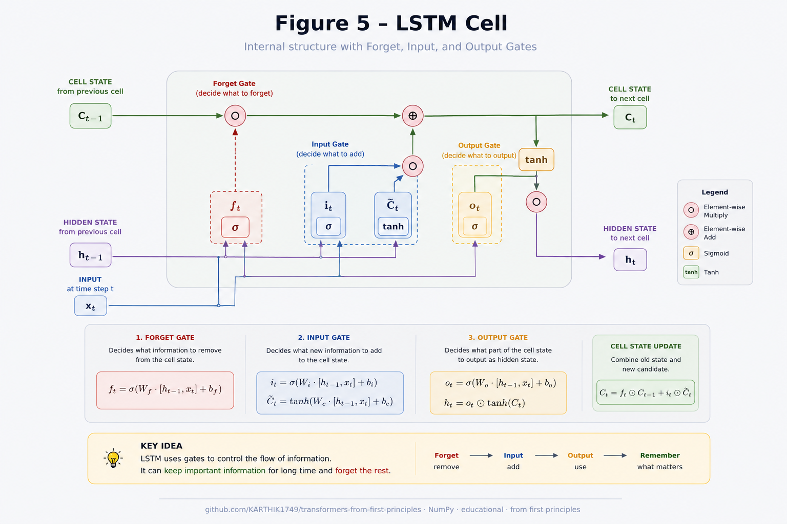
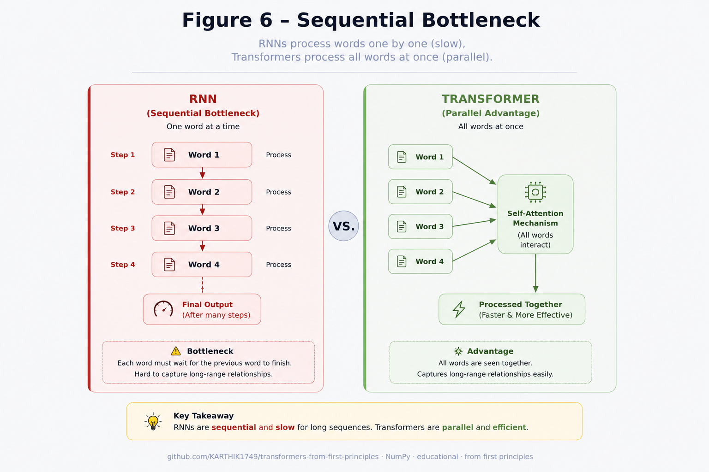
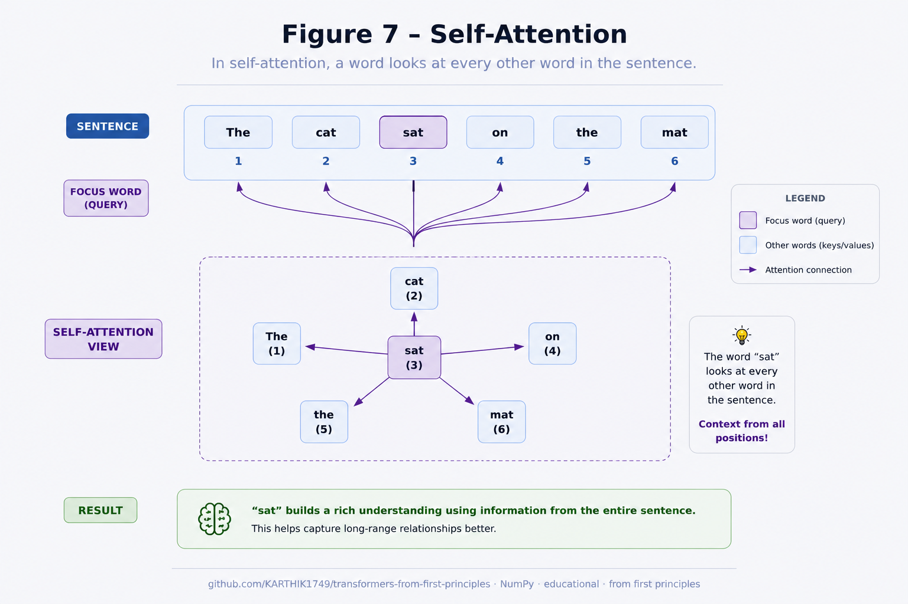

# Why Transformers?

---

# Learning Objectives

By the end of this chapter, you will be able to:

- Understand the evolution of sequence models.
- Explain the limitations of RNNs and LSTMs.
- Understand why self-attention was proposed.
- Explain why Transformers became the standard architecture for modern AI.

---

# The Problem

Before Transformers existed, sequence modelling relied primarily on:

- Feed Forward Neural Networks
- Recurrent Neural Networks (RNNs)
- Long Short-Term Memory (LSTMs)

Each generation tried to solve the shortcomings of the previous one.

---

## EVOLUTION OF SEQUENCIAL MODELS



---

# Why Feed Forward Networks Failed

Feed Forward Networks assume that every input is independent.

Consider the sentence:

> "The cat sat on the mat."

A feed-forward network processes every word independently.

```
"The" → Prediction

"cat" → Prediction

"sat" → Prediction

...
```

Since every word is processed independently, the model has no understanding of word order or context.

Obviously,

```
Dog bites man

≠

Man bites dog
```

although they contain exactly the same words.

---

## FEED FORWARD NETWORKS IGNORE ORDER



---

# Why Recurrent Neural Networks (RNNs) Were Invented

Instead of processing words independently, RNNs introduced the concept of **memory**.

The hidden state carries information from previous words.

```
x₁ → h₁

      ↓

x₂ → h₂

      ↓

x₃ → h₃

      ↓
     ...
```

Each hidden state depends on the previous one.

Mathematically,

$$
h_t = f(W_h h_{t-1} + W_x x_t)
$$

where

- $x_t$ is the current input,
- $h_{t-1}$ is the previous hidden state,
- $W_h$ and $W_x$ are learnable weight matrices.

---

## RNN ARCHITECTURE 



---

# The Problem with RNNs

Although RNNs introduced memory, they struggled with **long-term dependencies**.

Consider:

> "The book that I borrowed from the library three weeks ago was finally returned."

To correctly understand the word **was**, the model must remember **book** from many steps earlier.

As sequences grow longer, information from earlier tokens gradually fades.

This phenomenon is known as the **vanishing gradient problem**.

---

## VANISHING GRADIENTS IN RNNs 



---

# LSTMs: A Better Memory Mechanism

LSTMs were introduced to solve the vanishing gradient problem.

Instead of relying on a single hidden state, LSTMs introduced a dedicated **cell state** and three gates:

- Forget Gate
- Input Gate
- Output Gate

These gates allow the network to selectively retain or discard information.

---

## LSTM CELL 



---

# Why LSTMs Were Still Not Enough

Although LSTMs improved memory, they still had major limitations.

## 1. Sequential Processing

Tokens must be processed one after another.

```
Word 1

↓

Word 2

↓

Word 3

↓

Word 4
```

This prevents efficient parallel computation.

---

## 2. Long Paths Between Words

Suppose we want to relate

```
The animal didn't cross the road because **it** was tired.
```

To understand **it**, the model must propagate information through many intermediate states.

The computational path grows with sequence length.

---

## 3. Slow Training

Since every token depends on the previous hidden state, GPUs cannot process all tokens simultaneously.

Training becomes significantly slower.

---

## RNN VS TRANSFORMER



---

# Enter the Transformer

In 2017, researchers at Google introduced the paper:

> **Attention Is All You Need**

The key idea was revolutionary:

Instead of processing words sequentially,

every word should be able to directly attend to every other word.

This mechanism became known as **Self-Attention**.

Instead of remembering information through hidden states,

the model learns where to focus.

---

## SELF-ATTENTION



---

# Why Transformers Changed Everything

Transformers introduced several major advantages:

- Parallel processing of entire sequences.
- Better modelling of long-range dependencies.
- Faster training on GPUs.
- Improved scalability.
- Superior performance on NLP benchmarks.

These properties enabled models such as:

- BERT
- GPT
- T5
- Vision Transformer (ViT)

which power many modern AI applications today.

---

# Key Takeaways

- Feed Forward Networks ignored sequence information.
- RNNs introduced memory.
- LSTMs improved long-term memory.
- Sequential computation remained a bottleneck.
- Transformers replaced recurrence with self-attention.
- Self-attention enabled efficient parallel computation.

---

# Summary

Transformers were not invented because RNNs were useless.

They were invented because researchers needed a model that could:

- learn long-range dependencies,
- train efficiently on modern hardware,
- scale to billions of parameters,
- process sequences in parallel.

The Transformer architecture achieved all of these goals, making it the foundation of modern AI.

---

# What's Next?

Now that we understand **why** Transformers were invented,

the next chapter introduces the mathematical foundation that underpins every computation inside the model:

➡ **02_Matrix_mul.md**