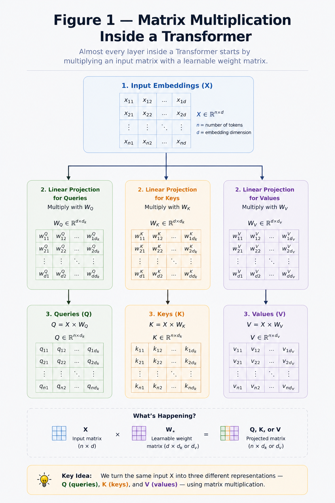
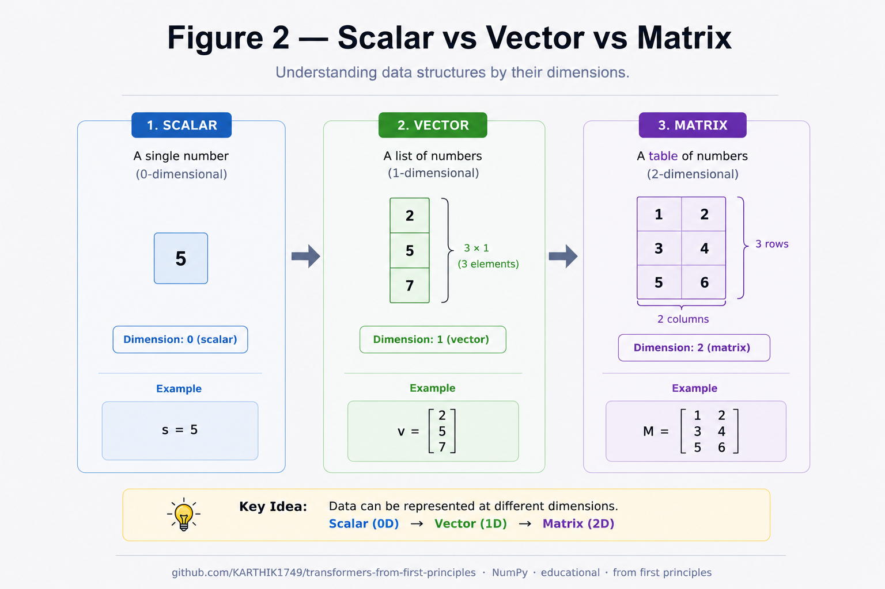
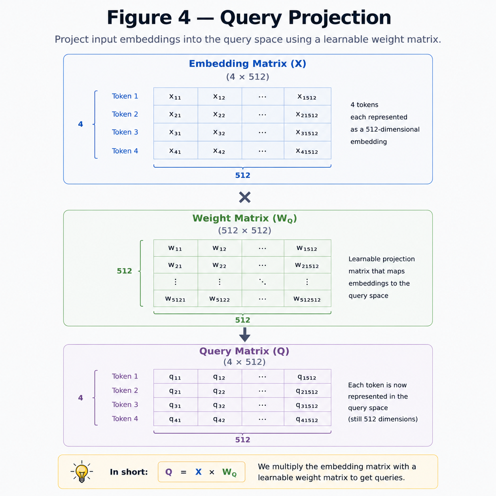

# Matrix Multiplication

**"Every major computation inside a Transformer is just matrix multiplication in disguise."**

---

# Learning Objectives

By the end of this chapter, you will be able to:

- Understand scalars, vectors and matrices.
- Perform matrix multiplication.
- Understand matrix shapes.
- Understand why matrix multiplication is everywhere in Transformers.

---

# Why Do We Need Matrix Multiplication?

Almost every operation inside a Transformer is a matrix multiplication.

For example,

- Embedding Lookup
- Query Projection
- Key Projection
- Value Projection
- Attention Scores
- Feed Forward Network
- Output Projection

can all be expressed as:

$$
Y = XW
$$

Understanding this single equation makes the rest of the repository much easier.

---

## MATRIX MULTIPLICATION INSIDE A TRANSFORMER



---

# Scalars, Vectors and Matrices

Before learning matrix multiplication, let's understand the building blocks.

### Scalar

A single number.

Example:

$$
5
$$

---

### Vector

A one-dimensional collection of numbers.

$$
\mathbf{x} =
\begin{bmatrix}
2\\
5\\
7
\end{bmatrix}
$$

Shape:

$$
(3,)
$$

---

### Matrix

A two-dimensional collection of numbers.

$$
A =
\begin{bmatrix}
1 & 2\\
3 & 4\\
5 & 6
\end{bmatrix}
$$

Shape:

$$
3 \times 2
$$

meaning

- 3 rows
- 2 columns

---

## SCALER VS VECTOR VS MATRIX



---

# Matrix Shapes

The **shape** tells us the dimensions of a matrix.

Example:

$$
A=
\begin{bmatrix}
1&2&3\\
4&5&6
\end{bmatrix}
$$

Shape:

$$
(2,3)
$$

meaning

- 2 rows
- 3 columns

Always remember:

> **Shape = (Rows, Columns)**

---

# Matrix Multiplication

Suppose we have

$$
A=
\begin{bmatrix}
1&2\\
3&4
\end{bmatrix}
$$

and

$$
B=
\begin{bmatrix}
5&6\\
7&8
\end{bmatrix}
$$

Then,

$$
C=A\times B
$$

To multiply two matrices,

> **The number of columns of the first matrix must equal the number of rows of the second matrix.**


---

# Mathematical Formula

The mathematical definition of matrix multiplication is:

$$
(AB)_{ij}=\sum_{k=1}^{n} a_{ik}b_{kj}
$$

where

- $i$ represents the row.
- $j$ represents the column.
- $k$ iterates over the shared dimension.

In simple words,

> Every element in the output matrix is obtained by taking the **dot product** of one row from the first matrix and one column from the second matrix.

---

# Numerical Example

Let

$$
A=
\begin{bmatrix}
1&2\\
3&4
\end{bmatrix}
$$

$$
B=
\begin{bmatrix}
5&6\\
7&8
\end{bmatrix}
$$

The first element becomes

$$
1\times5 + 2\times7 = 19
$$

The second element becomes

$$
1\times6 + 2\times8 = 22
$$

Similarly,

$$
3\times5 + 4\times7 = 43
$$

$$
3\times6 + 4\times8 = 50
$$

Therefore,

$$
AB=
\begin{bmatrix}
19&22\\
43&50
\end{bmatrix}
$$

---

# Matrix Multiplication Inside Transformers

Suppose

```
Sentence Length = 4

Embedding Dimension = 512
```

Then the embedding matrix has shape

$$
X \in \mathbb{R}^{4 \times 512}
$$

To generate the Query matrix,

we multiply

$$
Q = XW_Q
$$

where

$$
W_Q \in \mathbb{R}^{512 \times 512}
$$

Result:

$$
Q \in \mathbb{R}^{4 \times 512}
$$

Exactly the same operation is repeated to generate

- Query
- Key
- Value

This is why matrix multiplication is one of the most fundamental operations inside a Transformer.

---

## QUERY PROJECTION



---

# Key Takeaways

- Scalars are single numbers.
- Vectors are one-dimensional arrays.
- Matrices are two-dimensional arrays.
- Matrix multiplication requires matching inner dimensions.
- Every major Transformer computation relies on matrix multiplication.
- Understanding matrix shapes is more important than memorizing formulas.

---

# Summary

Matrix multiplication is the mathematical backbone of the Transformer architecture.

As you progress through this repository, you'll repeatedly encounter operations such as

$$
Q = XW_Q,\quad
K = XW_K,\quad
V = XW_V
$$

These are all simple matrix multiplications with different learnable weight matrices.

Understanding this chapter will make the implementation of Self-Attention and the entire Transformer much easier.

---

# What's Next?

Now that we understand how matrices interact, we can begin representing words as dense vectors.

➡ **Next Chapter:** `03_Embeddings.md`