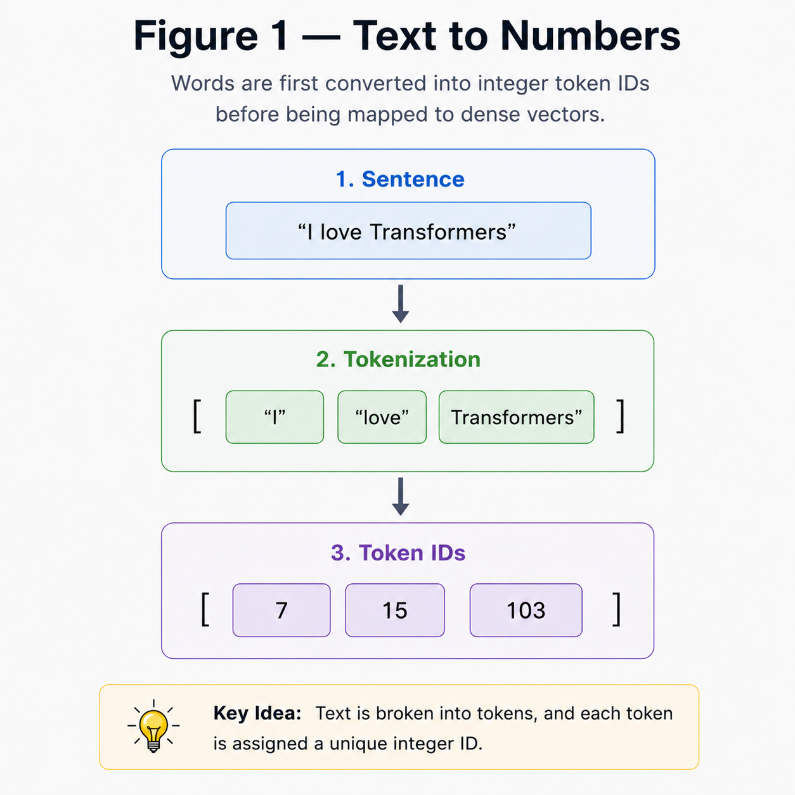
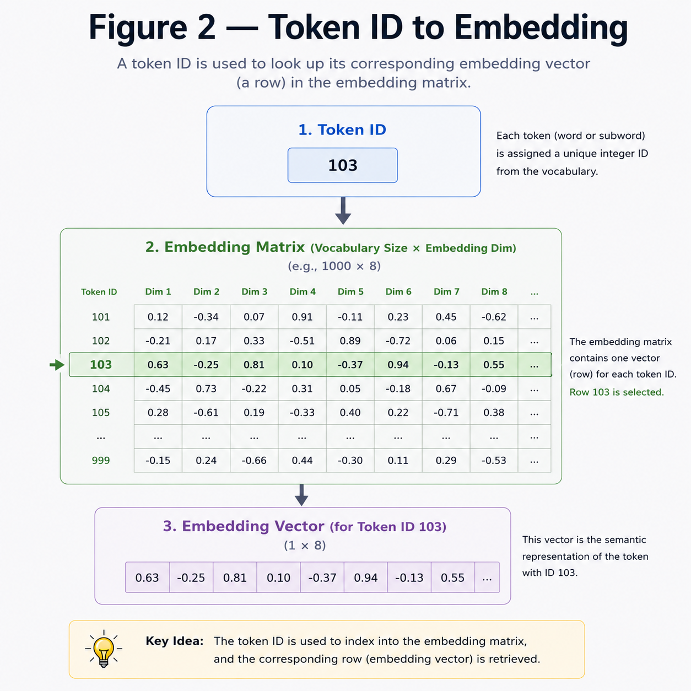
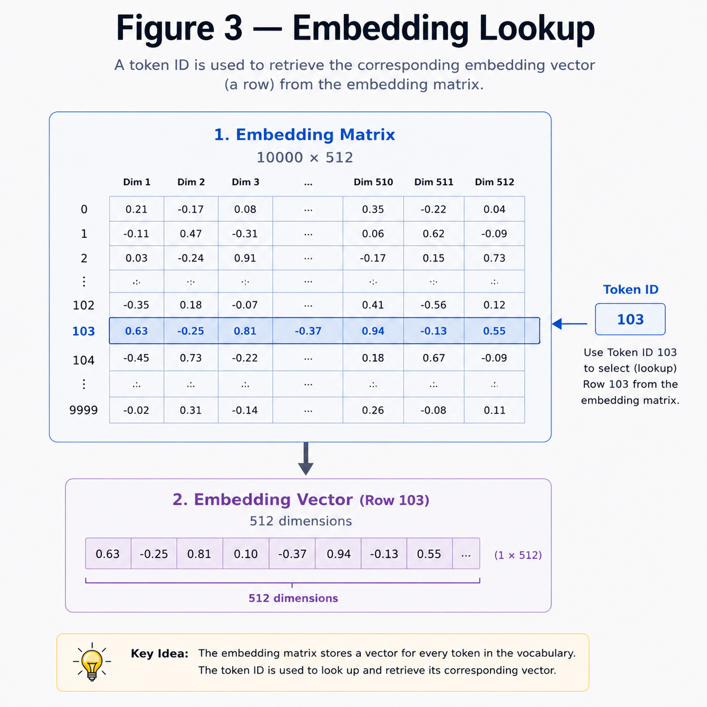
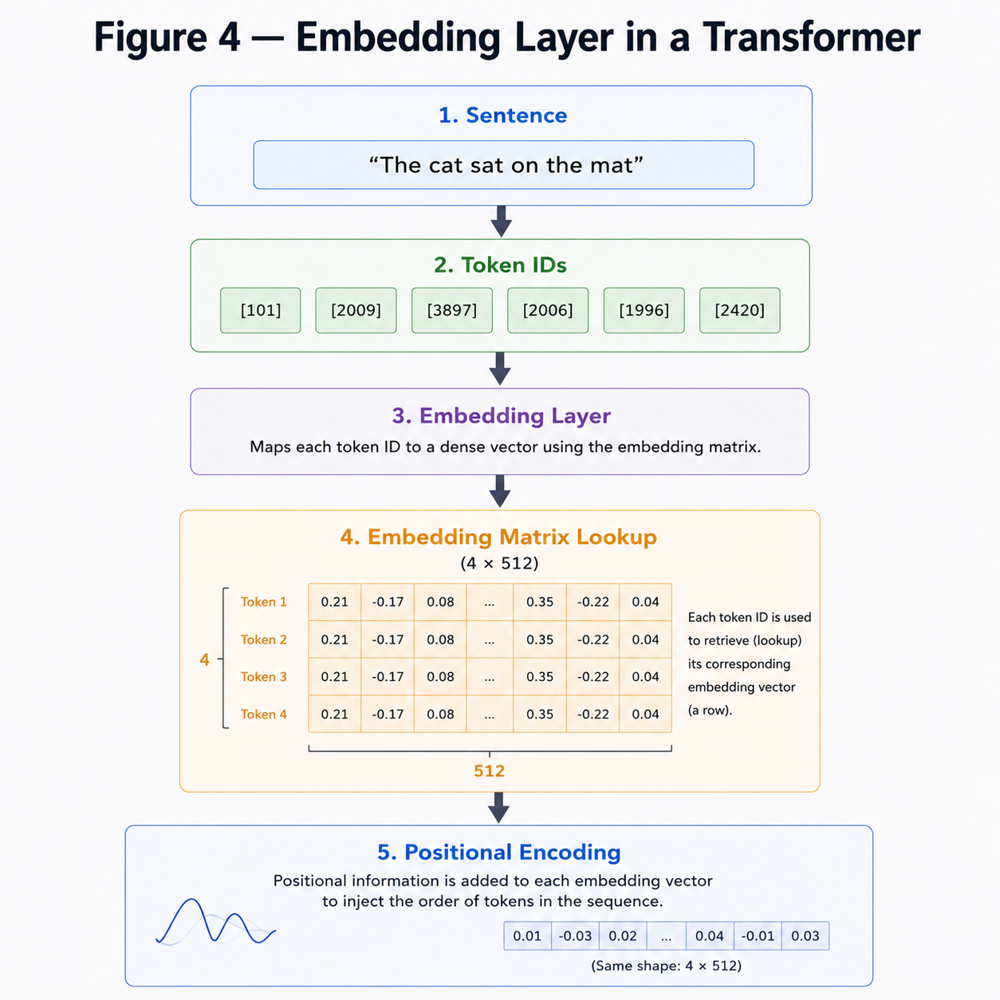

# Embeddings

**"Computers don't understand words—they understand numbers."**

---

# Learning Objectives

By the end of this chapter, you will be able to:

- Understand why words cannot be fed directly into a neural network.
- Understand what word embeddings are.
- Learn how an embedding matrix works.
- Understand the mathematics behind embedding lookup.

---

# Why Do We Need Embeddings?

Neural networks perform mathematical operations on numbers, not text.

Consider the sentence:

```
I love Transformers
```

A computer sees it as three strings.

```
"I"

"love"

"Transformers"
```

Since matrix multiplication only works on numbers, we first need to convert every word into a numerical representation.

This process is called **Embedding**.

---

## TEXT TO NUMBERS



---

# From Words to Token IDs

A vocabulary assigns a unique integer to every word.

| Word | Token ID |
|------|---------:|
| I | 7 |
| love | 15 |
| Transformers | 103 |
| AI | 205 |

Our sentence becomes

$$
[7,\;15,\;103]
$$

These integers are called **Token IDs**.

---

# What is an Embedding?

An embedding is a **dense vector representation** of a word.

Instead of representing a word using a single integer,

```
103
```

we represent it using hundreds of learned numbers.

Example

$$
Transformers
=
\begin{bmatrix}
0.12\\
-0.44\\
0.81\\
\vdots
\end{bmatrix}
$$

These numbers capture semantic meaning learned during training.

---

## TOKEN ID TO EMBEDDING



---

# Embedding Matrix

Assume

- Vocabulary Size = 10,000
- Embedding Dimension = 512

The embedding matrix is

$$
E \in \mathbb{R}^{10000 \times 512}
$$

where

- each row represents one token.
- each column represents one feature.

---

# Embedding Lookup

Suppose

$$
Token\ ID = 103
$$

The embedding layer simply selects

$$
E_{103}
$$

This is called an **Embedding Lookup**.

Notice that **no matrix multiplication happens here**.

It is simply an indexing operation.

---

## EMBEDDING LOOKUP



---

# Numerical Example

Vocabulary

| Token | ID |
|------|---:|
| I | 0 |
| love | 1 |
| AI | 2 |

Embedding Matrix

$$
E=
\begin{bmatrix}
0.2 & 0.5\\
0.7 & 0.1\\
0.4 & 0.8
\end{bmatrix}
$$

Sentence

```
I love AI
```

Token IDs

$$
[0,\;1,\;2]
$$

Embedding Output

$$
\begin{bmatrix}
0.2 & 0.5\\
0.7 & 0.1\\
0.4 & 0.8
\end{bmatrix}
$$

The embedding layer simply retrieves the corresponding rows.

---

# Embeddings Inside Transformers

Suppose

```
Sentence Length = 4

Embedding Dimension = 512
```

The embedding layer outputs

$$
X \in \mathbb{R}^{4 \times 512}
$$

This matrix becomes the input to the Transformer.

In the next chapter, we will see why this is still **not enough**, because the Transformer has no information about **word order**.

---

## EMBEDDING LAYER IN TRANSFORMER



---

# Key Takeaways

- Computers cannot process raw text.
- Every word is assigned a unique Token ID.
- The embedding matrix stores a learnable vector for every token.
- Embedding lookup is an indexing operation.
- The output of the embedding layer is a matrix of shape

$$
(sequence\ length,\ embedding\ dimension)
$$

---


# Summary

Embeddings convert words into dense numerical vectors that neural networks can process.

The output of the embedding layer becomes the input to the Transformer, where every token is represented as a high-dimensional vector.

However, these vectors contain **no information about the order of words**.

This leads to the next challenge.

---

# What's Next?

If the sentence

```
I love AI
```

and

```
AI love I
```

produce the same embeddings in a different order, how does the Transformer know which word comes first?

The answer is **Positional Encoding**.

➡ **Next Chapter:** `04_Positional_Encoding.md`