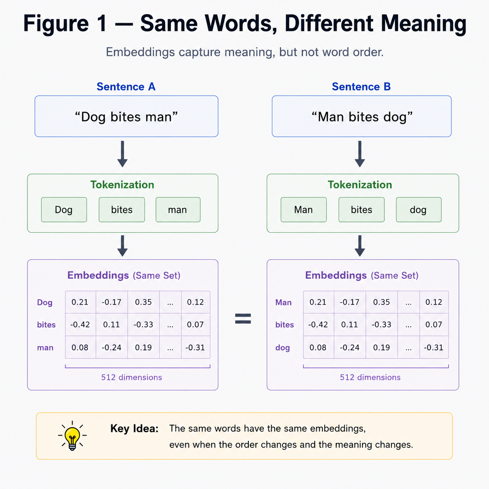
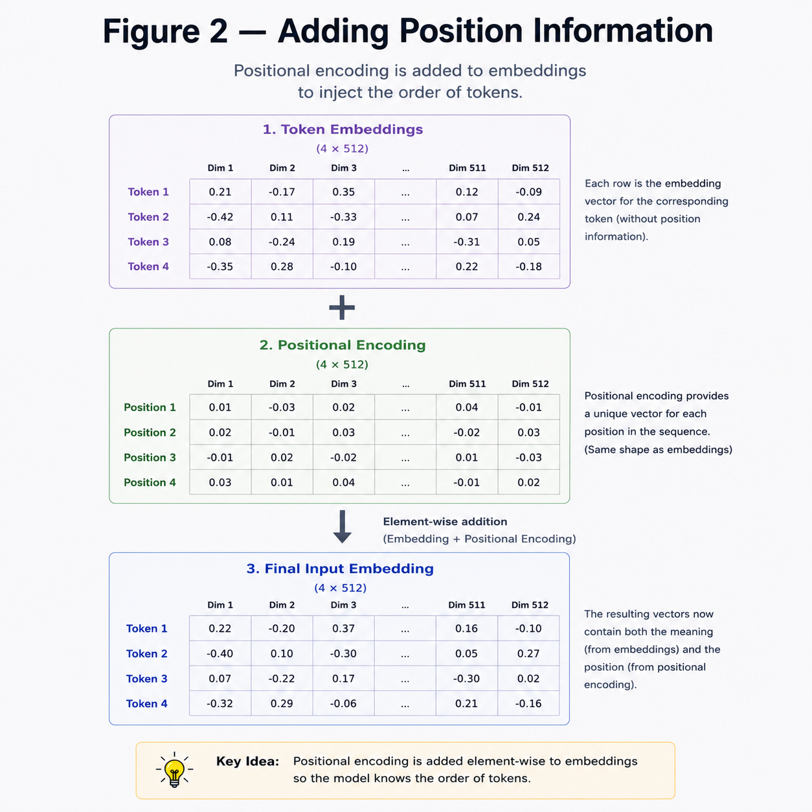
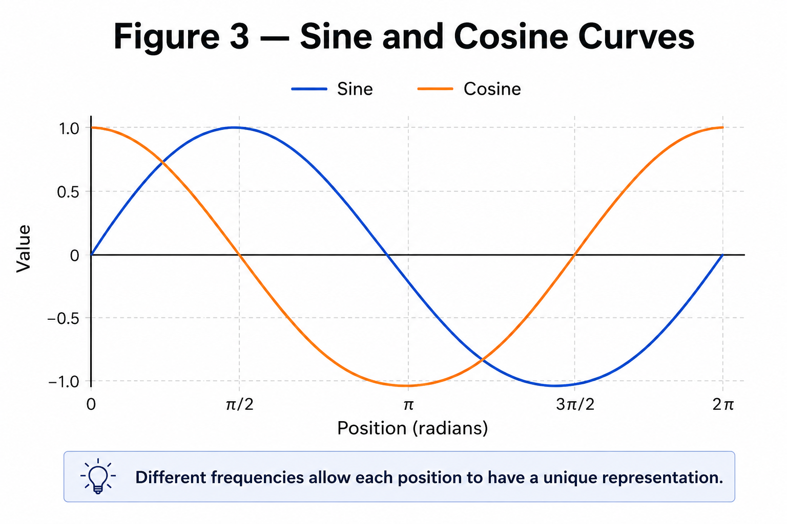
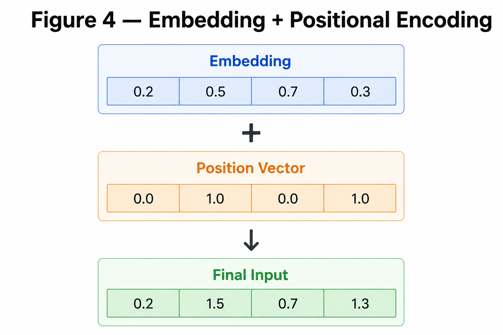
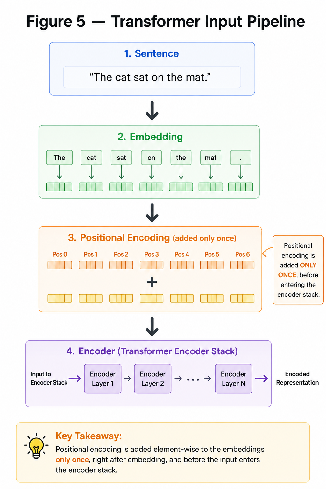

# Positional Encoding

**"Embeddings tell us what a word means. Positional Encoding tells us where the word appears."**

---

# Learning Objectives

By the end of this chapter, you will be able to:

- Understand why embeddings alone are not enough.
- Learn why Transformers need positional information.
- Understand the intuition behind positional encoding.
- Learn the mathematical formulation of sinusoidal positional encoding.

---

# Why Do We Need Positional Encoding?

Consider these two sentences:

```
Dog bites man
```

and

```
Man bites dog
```

Although both sentences contain the same words, they have completely different meanings.

Without positional information, the Transformer only sees the embeddings:

```
Dog
↓

Embedding
```

```
Bites
↓

Embedding
```

```
Man
↓

Embedding
```

It has **no idea** which word came first.

---

## DIFFERENCE IN MEANING OF THE SAME WORDS



---

# The Idea

To solve this problem, we add a unique positional vector to every embedding.

Instead of

$$
Embedding
$$

we compute

$$
Input = Embedding + PositionalEncoding
$$

Now every token carries two pieces of information:

- What the word means.
- Where the word appears.

---

## ADDING POSITION INFORMATION 



---

# Mathematical Formulation

The original Transformer paper introduced **Sinusoidal Positional Encoding**.

For even dimensions,

$$
PE(pos,2i)=\sin\left(\frac{pos}{10000^{2i/d_{model}}}\right)
$$

For odd dimensions,

$$
PE(pos,2i+1)=\cos\left(\frac{pos}{10000^{2i/d_{model}}}\right)
$$

where

- $pos$ is the token position.
- $i$ is the embedding dimension.
- $d_{model}$ is the embedding size.

---

# Why Sine and Cosine?

Instead of learning positional vectors,

the Transformer generates them using sine and cosine functions.

This provides two important advantages:

- Every position gets a unique encoding.
- The model can generalize to sequence lengths not seen during training.

---

## SINE AND COSINE CURVES



---

# Numerical Example

Suppose

```
Embedding Dimension = 4
```

For Position 0,

Positional Encoding becomes approximately

$$
[0,\;1,\;0,\;1]
$$

Suppose the embedding is

$$
[0.2,\;0.5,\;0.7,\;0.3]
$$

The final input becomes

$$
\begin{aligned}
&[0.2,\;0.5,\;0.7,\;0.3] \\
+&[0,\;1,\;0,\;1] \\
=&[0.2,\;1.5,\;0.7,\;1.3]
\end{aligned}
$$

The Transformer now knows both **what** the token is and **where** it appears.

---

## POSITIONAL AND EMBEDDING ENCODING 



---

# Positional Encoding Inside the Transformer

The complete input pipeline now becomes

```
Sentence

↓

Token IDs

↓

Embedding Layer

↓

Positional Encoding

↓

Input Matrix

↓

Self Attention
```

Every token entering the Transformer already contains semantic information and positional information.

---

## TRANSFORMERS INPUT PIPELINE



---

# Key Takeaways

- Embeddings capture meaning.
- Embeddings do not capture word order.
- Positional Encoding injects sequence information.
- The original Transformer uses sine and cosine functions.
- Final input = Embedding + Positional Encoding.

---

# Summary

The embedding layer tells the Transformer **what each word means**.

Positional Encoding tells the Transformer **where each word occurs**.

Together, they produce the final input representation that is passed into the encoder.

However, every token is still processed independently.

The next challenge is enabling tokens to understand **each other**.

---

# What's Next?

Now that every token has both **meaning** and **position**, how can one word decide which other words are important?

The answer is **Attention**.

➡ **Next Chapter:** `05_Attention.md`