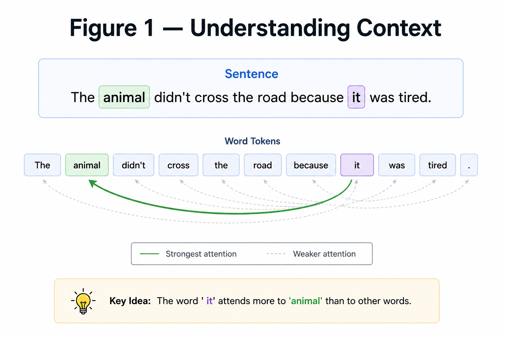
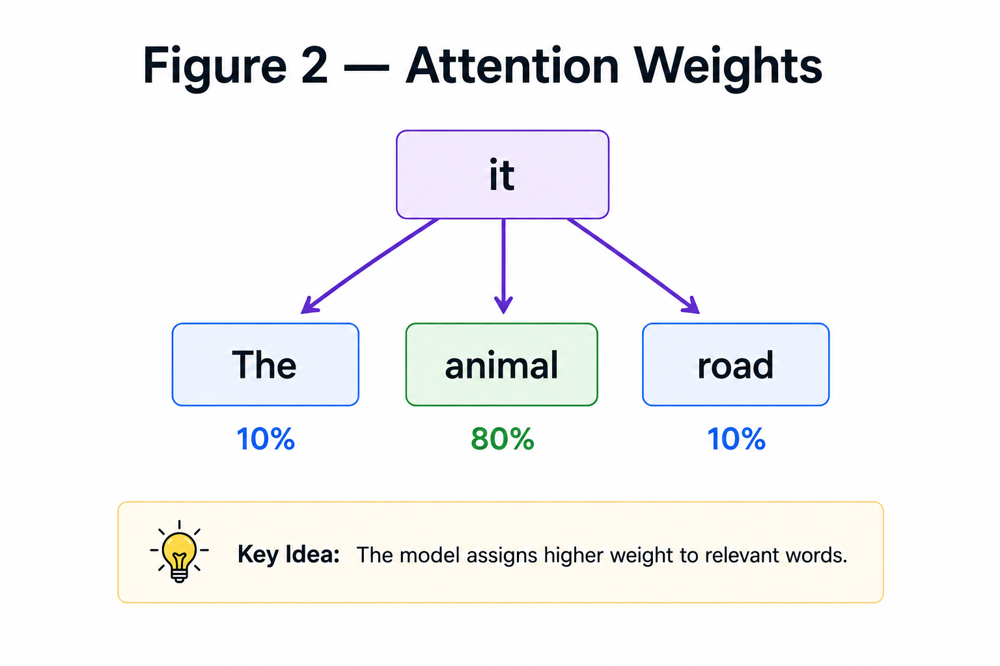
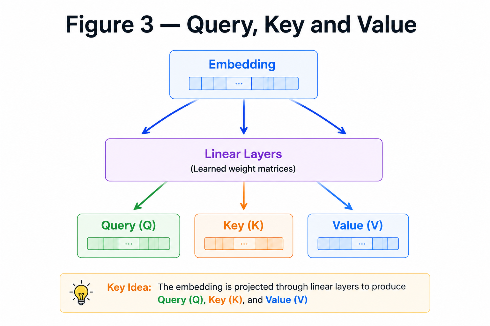
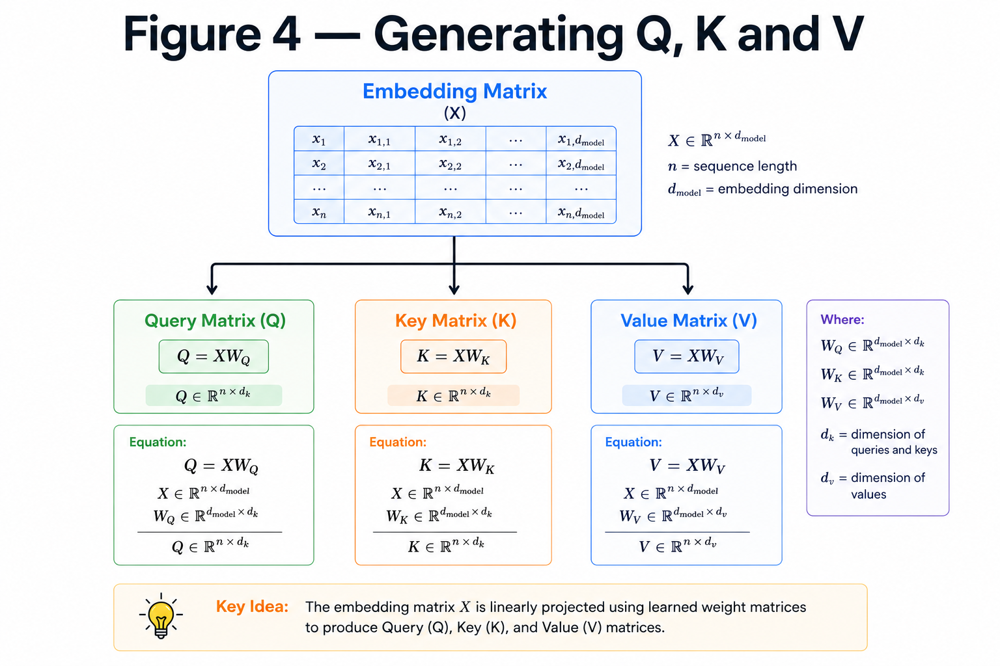

# Attention

**"Instead of remembering everything, focus only on what matters."**

---

# Learning Objectives

By the end of this chapter, you will be able to:

- Understand the intuition behind Attention.
- Learn why Attention is needed.
- Understand Query, Key, and Value.
- See how Attention prepares the Transformer for Self-Attention.

---

# Why Do We Need Attention?

Consider the sentence

```
The animal didn't cross the road because it was tired.
```

What does **"it"** refer to?

- Road - No
- Animal - Yes

Humans immediately understand that **"it"** refers to **animal**.

A Transformer must learn the same relationship.

Instead of treating every word equally, it should focus more on the important words.

This idea is called **Attention**.

---

## CONTEXTUAL UNDERSTANDING



---

# What is Attention?

Attention is a mechanism that tells the model

> **"Which words should I pay attention to?"**

Instead of using the entire sentence equally,

each word assigns different importance (weights) to every other word.

Words with higher importance influence the output more.

---

## ATTENTION WEIGHTS



---

# Query, Key and Value

Every input embedding is transformed into three vectors:

- **Query (Q)** → What am I looking for?
- **Key (K)** → What information do I contain?
- **Value (V)** → What information should I pass?

Think of it like a search engine:

- Query → Search text
- Key → Web page titles
- Value → Web page content

The query is compared with every key.

The most relevant values are returned.

---

##  QUERY, KEY AND VALUE



---

# Mathematical Representation

Each embedding matrix

$$
X
$$

is projected into

$$
Q = XW_Q
$$

$$
K = XW_K
$$

$$
V = XW_V
$$

where

- $W_Q$
- $W_K$
- $W_V$

are learnable weight matrices.

Notice that all three start from the **same input** but learn different representations.

---

## GENERATING Q, K AND V



---

# Numerical Example

Suppose the embedding matrix is

$$
X=
\begin{bmatrix}
1 & 2\\
3 & 4
\end{bmatrix}
$$

Using three different weight matrices,

we compute

$$
Q=XW_Q
$$

$$
K=XW_K
$$

$$
V=XW_V
$$

Even though the input is the same,

the outputs are different because each weight matrix learns a different transformation.

---

# Why Three Different Matrices?

Each matrix has a different role.

| Matrix | Purpose |
|---------|----------|
| Query | Searches for relevant information |
| Key | Describes available information |
| Value | Contains the actual information |

Together they allow every token to decide

> "Which other tokens are important for me?"

---

# Key Takeaways

- Attention helps the model focus on important words.
- Every token attends to every other token.
- Query asks questions.
- Key answers those questions.
- Value carries the information.
- Q, K and V are generated using three separate linear transformations.

---


# Summary

Attention allows every token to decide which other tokens are most relevant.

To do this, every embedding is converted into three vectors:

- Query
- Key
- Value

The next chapter explains how these three matrices interact mathematically using the **Scaled Dot-Product Attention** equation.

---

# What's Next?

Now that we know what Query, Key and Value are,

how do they actually compute attention?

The answer lies in one of the most important equations in the Transformer architecture:

$$
Attention(Q,K,V)
=
softmax
\left(
\frac{QK^T}{\sqrt{d_k}}
\right)
V
$$

➡ **Next Chapter:** `06_Scaled_Dot_Product_Attention.md`