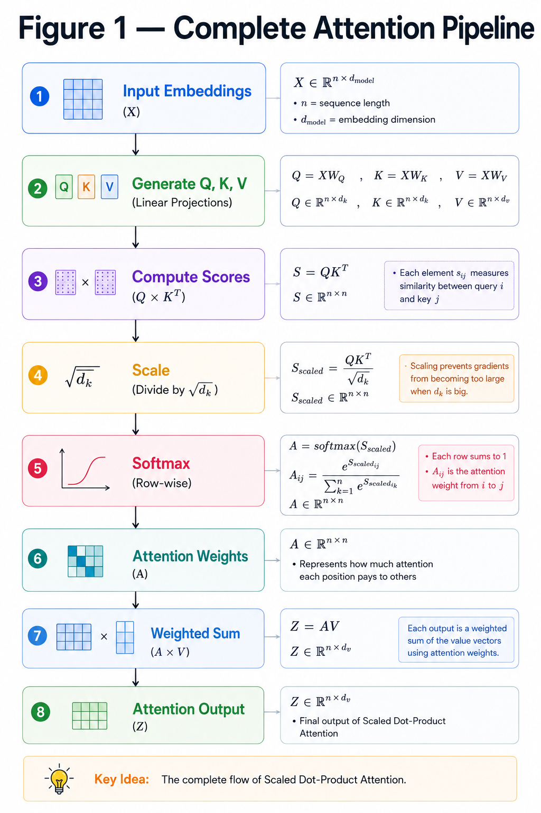
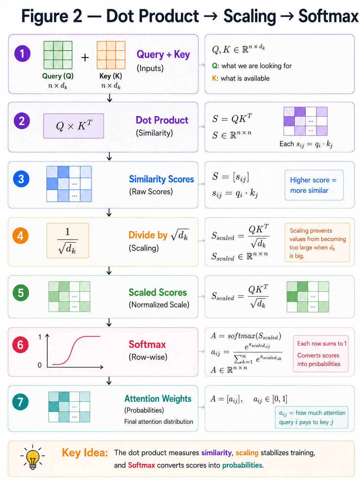
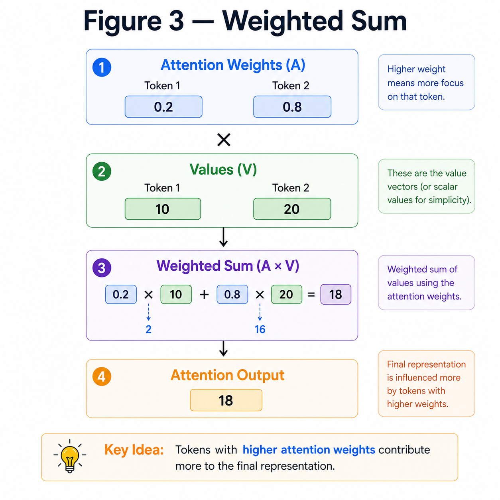

# Scaled Dot-Product Attention

**"Attention is simply a weighted combination of information from the most relevant tokens."**

---

# Learning Objectives

By the end of this chapter, you will be able to:

- Understand how Attention is computed mathematically.
- Learn why Query, Key and Value are required.
- Understand the purpose of scaling.
- Learn the complete Attention equation.

---

# From Query, Key and Value to Attention

In the previous chapter, we learned that every token generates three vectors:

- Query (Q)
- Key (K)
- Value (V)

The next question is:

> **How does a Query decide which tokens are important?**

It compares itself with every Key.

A higher similarity means the corresponding Value should receive more attention.

---

## ATTENTION PIPELINE 



---

# Step 1 — Compute Similarity Scores

The similarity between Query and Key is computed using a **dot product**.

$$
Score = QK^T
$$

A larger score means the Query and Key are more related.

For example,

$$
Q=
\begin{bmatrix}
1 & 2
\end{bmatrix}
,
\quad
K=
\begin{bmatrix}
3 & 4
\end{bmatrix}
$$

Then,

$$
QK^T = 1\times3 + 2\times4 = 11
$$

---

# Step 2 — Scale the Scores

As the embedding dimension grows,

the dot-product values become very large.

Large values make Softmax extremely sharp, slowing down learning.

To avoid this, we divide by

$$
\sqrt{d_k}
$$

where

- $d_k$ is the Key dimension.

The scaled score becomes

$$
\frac{QK^T}{\sqrt{d_k}}
$$

---

# Step 3 — Apply Softmax

The scaled scores are converted into probabilities using Softmax.

$$
Softmax(x_i)=
\frac{e^{x_i}}
{\sum_j e^{x_j}}
$$

Example

```
Scores

[2,4]

↓

Softmax

[0.12,0.88]
```

Now

- every value lies between **0 and 1**
- all values sum to **1**

These become the **attention weights**.

---

## DOT PRODUCT AND SCALING



---

# Step 4 — Compute the Final Output

The attention weights determine how much information should be taken from each Value vector.

The complete equation is

$$
Attention(Q,K,V)
=
Softmax
\left(
\frac{QK^T}
{\sqrt{d_k}}
\right)
V
$$

Read it from left to right:

1. Compare Queries with Keys.
2. Scale the scores.
3. Apply Softmax.
4. Use the resulting probabilities to combine the Value vectors.

---

# Numerical Example

Suppose

```
Attention Weights

[0.2,0.8]
```

and

```
Values

[10,20]
```

The output becomes

$$
0.2\times10 + 0.8\times20 = 18
$$

Since the second token received a higher attention weight,

it contributes more to the final output.

---

## WEIGHTED SUM 



---

# Key Takeaways

- Dot Product measures similarity.
- Scaling prevents extremely large attention scores.
- Softmax converts scores into probabilities.
- Attention is simply a weighted sum of the Value vectors.
- Every Transformer layer performs this computation.

---

# Summary

Scaled Dot-Product Attention is the mathematical core of the Transformer.

Every token compares itself with all other tokens, computes attention weights, and gathers information from the most relevant Value vectors.

This mechanism allows the Transformer to capture relationships between words regardless of their distance in the sequence.

---

# What's Next?

So far, we've computed Attention using a **single** set of Query, Key and Value vectors.

The Transformer improves this idea by running **multiple Attention mechanisms in parallel**, allowing it to learn different relationships simultaneously.

This leads to **Multi-Head Attention**.

➡ **Next Chapter:** `07_Multi_Head_Attention.md`