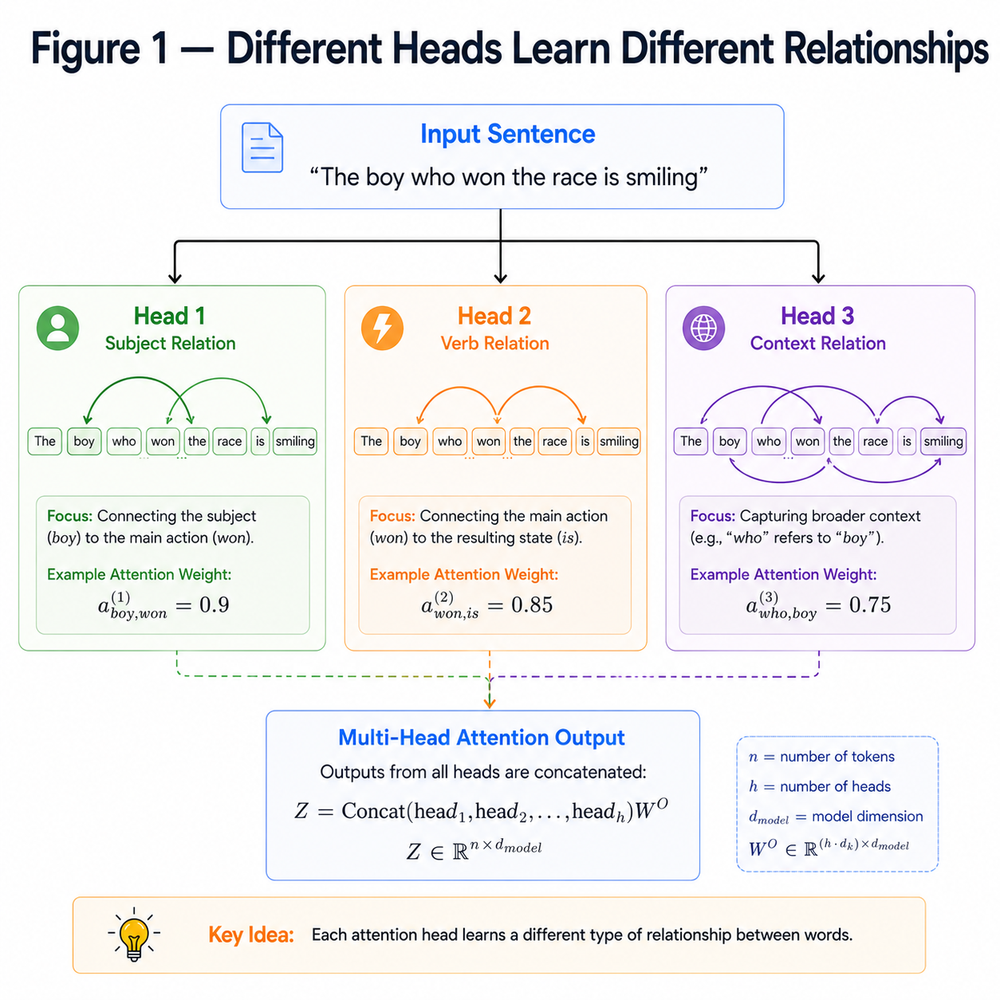
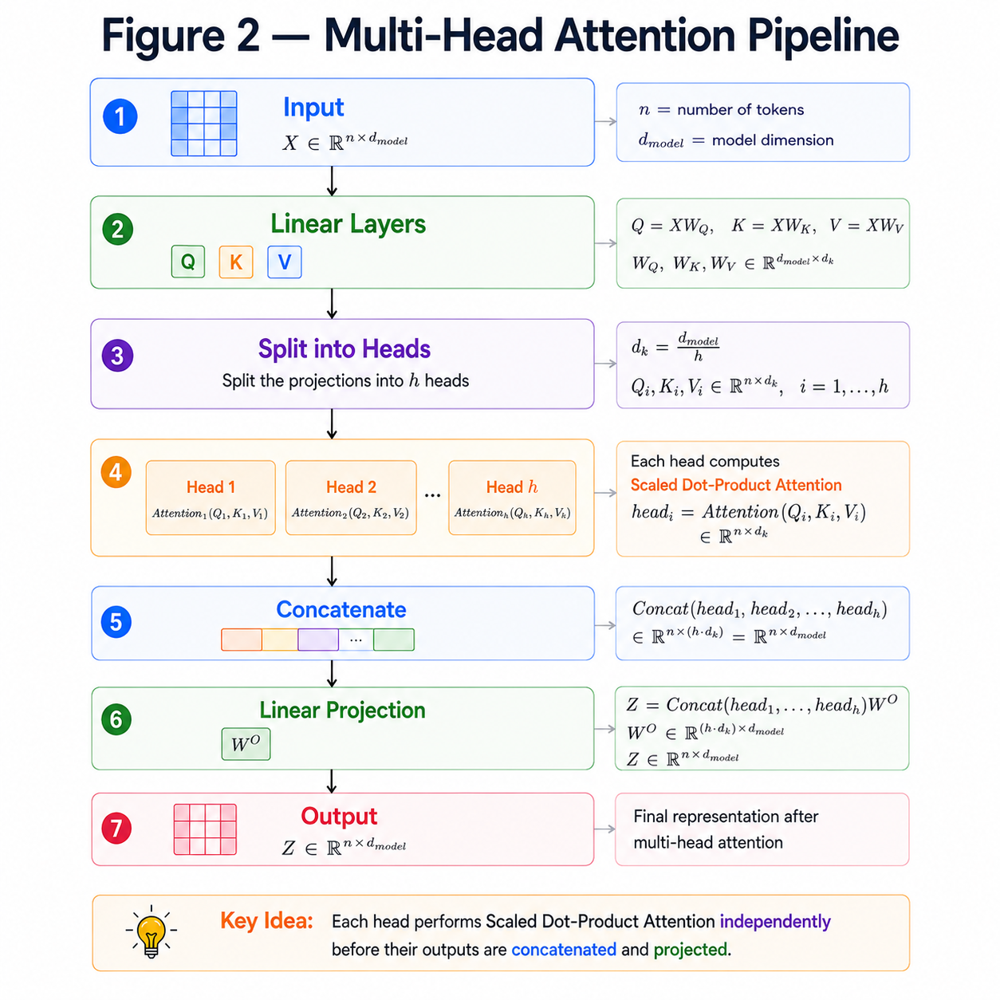
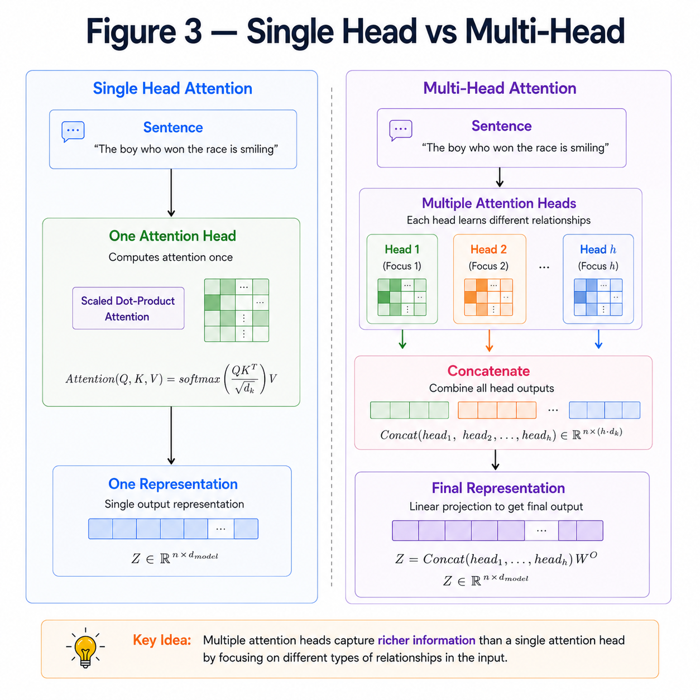

# Multi-Head Attention

**"Instead of learning one relationship at a time, learn multiple relationships simultaneously."**

---

# Learning Objectives

By the end of this chapter, you will be able to:

- Understand why a single Attention head is not enough.
- Learn how Multi-Head Attention works.
- Understand splitting, parallel attention, concatenation and projection.
- See how Multi-Head Attention improves the Transformer.

---

# Why Multiple Attention Heads?

Suppose we have the sentence

```
The boy who won the race is smiling.
```

Different words capture different relationships.

One attention head might focus on

```
boy  ↔ smiling
```

Another might focus on

```
won ↔ race
```

A third might learn grammatical relationships.

Using only one Attention head forces the model to learn all these relationships together.

Instead, the Transformer uses **multiple Attention heads**, allowing each head to specialize.

---

## DIIFERENT HEADS LEARN DIFFERENT RELATIONS



---

# How Multi-Head Attention Works

Instead of computing one Attention,

the Transformer computes several Attention operations in parallel.

Each head has its own

- Query matrix
- Key matrix
- Value matrix

Mathematically,

$$
head_i =
Attention(Q_i,K_i,V_i)
$$

where

$$
i = 1,2,\dots,h
$$

and

$h$ is the number of attention heads.

---

# Splitting into Multiple Heads

Suppose

```
Embedding Dimension = 512

Number of Heads = 8
```

Each head receives

$$
\frac{512}{8}=64
$$

features.

Instead of one large Attention,

we compute

```
8

small

Attention

operations
```

in parallel.

---

# Concatenating the Heads

After computing every head,

their outputs are concatenated together.

$$
MultiHead =
Concat(head_1,head_2,\dots,head_h)
$$

Finally,

another learnable matrix projects the concatenated output back to the original embedding dimension.

$$
Output =
Concat(head_i)W_O
$$

where

$$
W_O
$$

is the output projection matrix.

---

## MULTI-HEAD ATTENTION PIPELINE



---

# Numerical Example

Suppose

```
Embedding Dimension = 8

Heads = 2
```

Each head processes

```
4 dimensions
```

instead of

```
8 dimensions
```

If

```
Head 1 Output

[1,2,3,4]
```

and

```
Head 2 Output

[5,6,7,8]
```

Concatenation gives

```
[1,2,3,4,5,6,7,8]
```

This vector is then multiplied by the output weight matrix

$$
W_O
$$

to produce the final output.

---

# Why Is Multi-Head Attention Better?

Using multiple heads allows the Transformer to

- Learn different semantic relationships.
- Capture both local and global context.
- Improve representation learning.
- Increase model capacity without changing the overall embedding dimension.

Instead of looking at the sentence from one perspective,

the model learns several perspectives simultaneously.

---

## SINGLE HEAD VS MULTI-HEAD ATTENTION



---

# Key Takeaways

- A single Attention head has limited learning capacity.
- Multi-Head Attention runs several Attention operations in parallel.
- Each head learns different relationships.
- Outputs from all heads are concatenated.
- A final linear projection combines information from every head.

---


# Summary

Multi-Head Attention extends Scaled Dot-Product Attention by running multiple attention heads in parallel.

Each head focuses on different aspects of the input sequence.

Their outputs are concatenated and projected to produce a richer representation, making Multi-Head Attention one of the key innovations of the Transformer architecture.

---

# What's Next?

After Multi-Head Attention, the output is **not** sent directly to the next layer.

Instead, the Transformer introduces two important ideas:

- **Residual Connections**
- **Layer Normalization**

These help stabilize training and allow Transformers to scale to hundreds of layers.

➡ **Next Chapter:** `08_Residual_Connections&_LayerNorm.md`