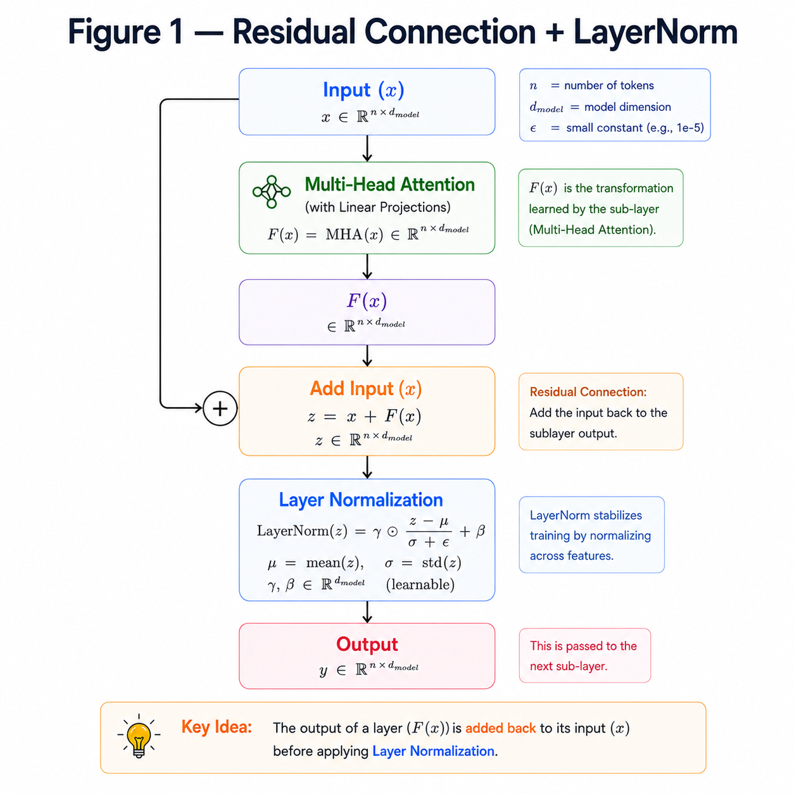
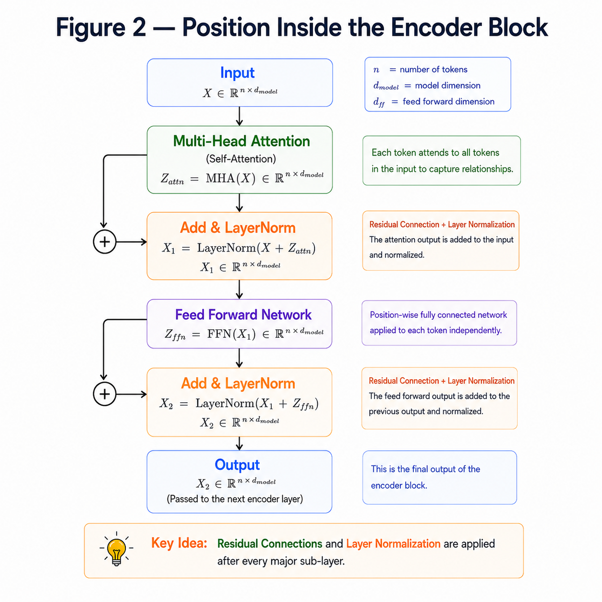
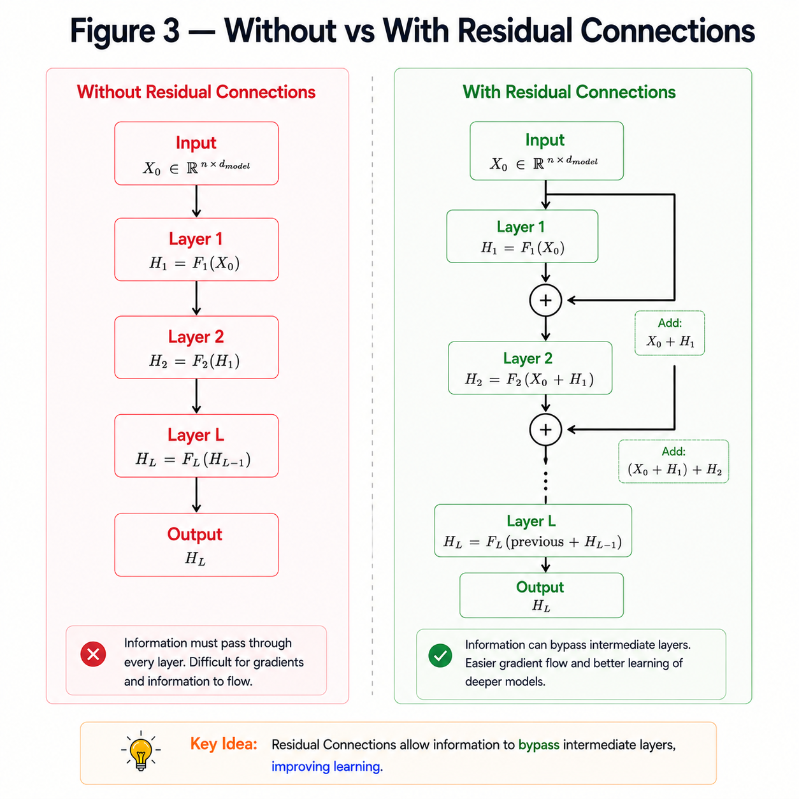

# Residual Connections & Layer Normalization

**"Residual Connections preserve information, while Layer Normalization stabilizes learning."**

---

# Learning Objectives

By the end of this chapter, you will be able to:

- Understand why Residual Connections are used.
- Learn how Layer Normalization works.
- See why these two components always appear together.
- Understand their role inside the Encoder and Decoder.

---

# Why Do We Need Residual Connections?

As neural networks become deeper,

information from earlier layers gradually fades.

This makes training difficult.

Residual Connections solve this problem by allowing the original input to skip a layer.

Instead of learning

$$
F(x)
$$

the network learns

$$
F(x)+x
$$

where

- $F(x)$ is the output of a layer.
- $x$ is the original input.

This simple addition allows information and gradients to flow more easily through the network.

---

## RESIDUAL CONNECTIONS + LAYER NORM



---

# What is Layer Normalization?

After adding the residual,

the values may have different scales.

Layer Normalization standardizes these values,

making training faster and more stable.

Given an input vector

$$
x=[x_1,x_2,\dots,x_n]
$$

Layer Normalization computes

$$
\hat{x}=\frac{x-\mu}{\sqrt{\sigma^2+\epsilon}}
$$

where

- $\mu$ is the mean.
- $\sigma^2$ is the variance.
- $\epsilon$ is a small constant for numerical stability.

Finally,

$$
y=\gamma\hat{x}+\beta
$$

where

- $\gamma$ and $\beta$ are learnable parameters.

---

# Numerical Example

Suppose

```
Input

[2,4,6]
```

Mean

$$
\mu=4
$$

Normalized Output

```
[-1.22,0,1.22]
```

The values now have

- mean ≈ 0
- variance ≈ 1

making optimization much more stable.

---

# Residual + LayerNorm Inside a Transformer

Every Encoder Block follows this pattern:

```
Multi-Head Attention

↓

Residual Add

↓

LayerNorm

↓

Feed Forward

↓

Residual Add

↓

LayerNorm
```

The Decoder uses the same pattern after each attention module and the feed-forward network.

---

## POSITION INSIDE ENCODER BLOCK 



---

# Why Both Together?

Residual Connections

- Preserve information.

- Improve gradient flow.

- Enable very deep networks.

Layer Normalization

- Stabilizes activations.

- Speeds up convergence.

- Makes training more reliable.

Together they make modern Transformers train efficiently.

---

## IMPORTANCE OF RESIDUAL CONNECTIONS



---

# Key Takeaways

- Residual Connections add the original input back to the output.
- Layer Normalization standardizes activations.
- Residual Connections preserve information.
- LayerNorm stabilizes training.
- Every Encoder and Decoder block uses both operations.

---

# Summary

Residual Connections allow the Transformer to preserve information and train deeper networks.

Layer Normalization keeps activations well-scaled and improves optimization.

Together, these two components form the backbone of every Encoder and Decoder block.

---

# What's Next?

After Multi-Head Attention, Residual Connections and LayerNorm prepare the representation for the next major component:

**The Feed Forward Network (FFN).**

Unlike Attention, which mixes information between tokens, the Feed Forward Network processes each token independently.

➡ **Next Chapter:** `09_Feed_Forward_Network.md`