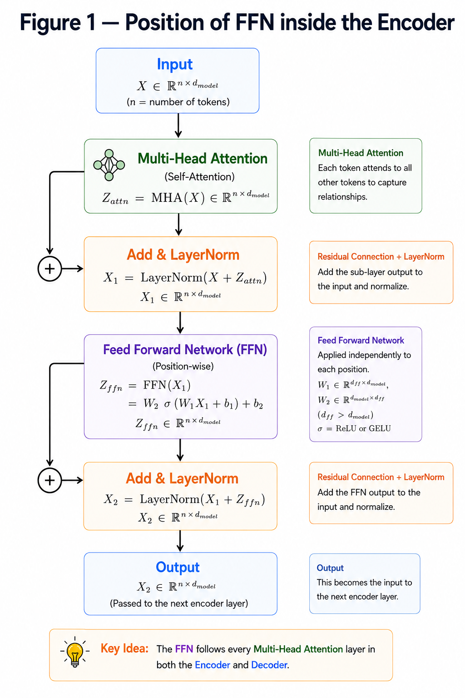
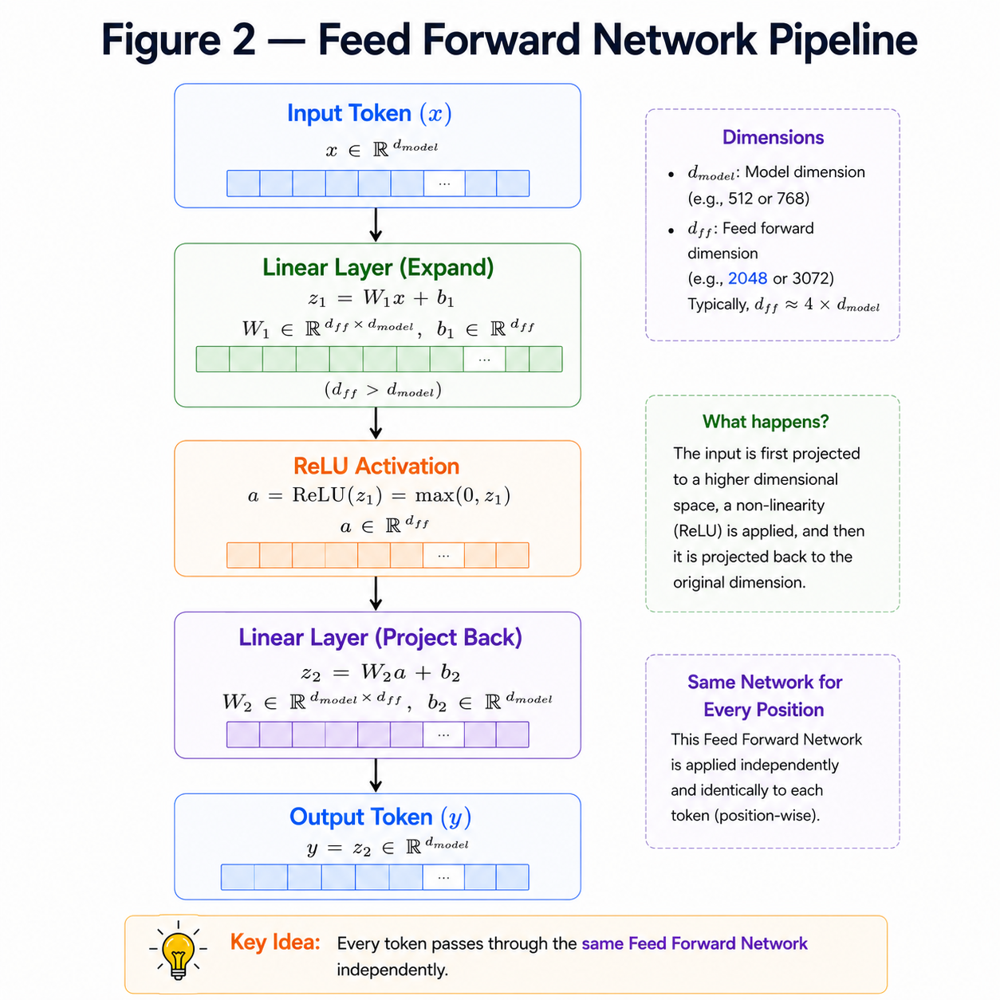

# Feed Forward Network (FFN)

**"Attention lets tokens communicate with each other. The Feed Forward Network processes each token independently."**

---

# Learning Objectives

By the end of this chapter, you will be able to:

- Understand the purpose of the Feed Forward Network (FFN).
- Learn why it follows every Attention layer.
- Understand the two-layer architecture.
- Learn the mathematical formulation of FFN.

---

# Why Do We Need a Feed Forward Network?

Attention allows tokens to exchange information.

However, after gathering information from other tokens, each token still needs to process its own features.

This is the role of the **Feed Forward Network (FFN).**

Unlike Attention, the FFN **does not mix information between different tokens**.

Instead, it processes **each token independently** using the same neural network.

---

## POSITION OF FFN



---

# How Does the FFN Work?

The Feed Forward Network consists of two fully connected (Linear) layers with an activation function in between.

The architecture is

```
Linear

↓

ReLU

↓

Linear
```

The first layer expands the feature dimension.

The second layer projects it back to the original embedding dimension.

---

# Mathematical Formulation

The FFN is defined as

$$
FFN(x)=\max(0,xW_1+b_1)W_2+b_2
$$

where

- $W_1$ and $W_2$ are learnable weight matrices.
- $b_1$ and $b_2$ are learnable bias vectors.
- ReLU is used as the activation function.

The ReLU function is

$$
ReLU(x)=\max(0,x)
$$

which simply replaces all negative values with zero.

---

# Numerical Example

Suppose

```
Input Token

[2,-1]
```

After the first Linear layer,

```
[3,-2,5]
```

Applying ReLU,

```
[3,0,5]
```

After the second Linear layer,

```
[1.4,2.7]
```

This becomes the updated representation of the token.

---

## FEED FORWARD NETWORK PIPELINE



---

# FFN Inside the Transformer

Suppose

```
Sequence Length = 4

Embedding Dimension = 512

Hidden Dimension = 2048
```

The FFN transforms

$$
(4 \times 512)
$$

↓

$$
(4 \times 2048)
$$

↓

$$
(4 \times 512)
$$

Notice that

- the **sequence length remains unchanged**
- only the feature dimension changes

Every token is processed independently using the same weights.

---

# Key Takeaways

- FFN follows every Multi-Head Attention layer.
- It consists of two Linear layers and one ReLU activation.
- It processes each token independently.
- The feature dimension expands and then contracts.
- The sequence length remains unchanged.

---


# Summary

The Feed Forward Network is a simple yet powerful component of the Transformer.

While Attention allows tokens to exchange information, the FFN refines the representation of each token individually.

Together with Multi-Head Attention, Residual Connections, and Layer Normalization, it forms the complete building block of the Transformer.

---

# What's Next?

We have now learned every individual component required to build an Encoder.

The next chapter combines these components into the **Encoder Block** and then stacks multiple Encoder Blocks to form the **Encoder Stack**.

➡ **Next Chapter:** `10_Encoder.md`