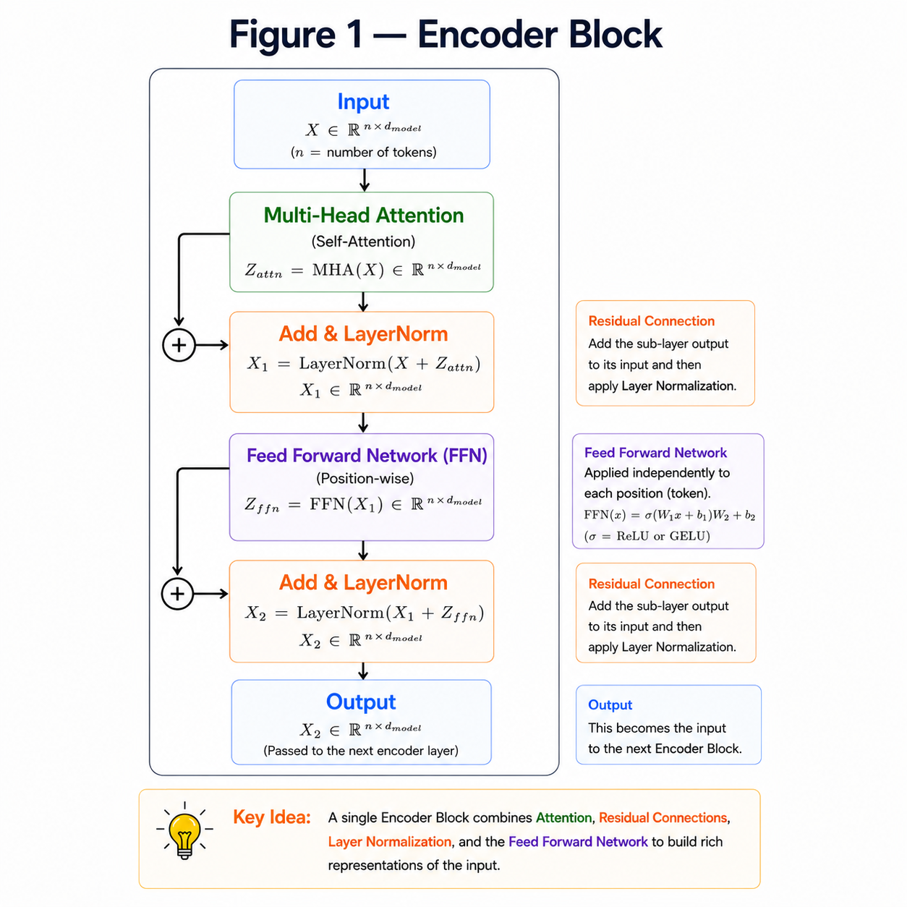
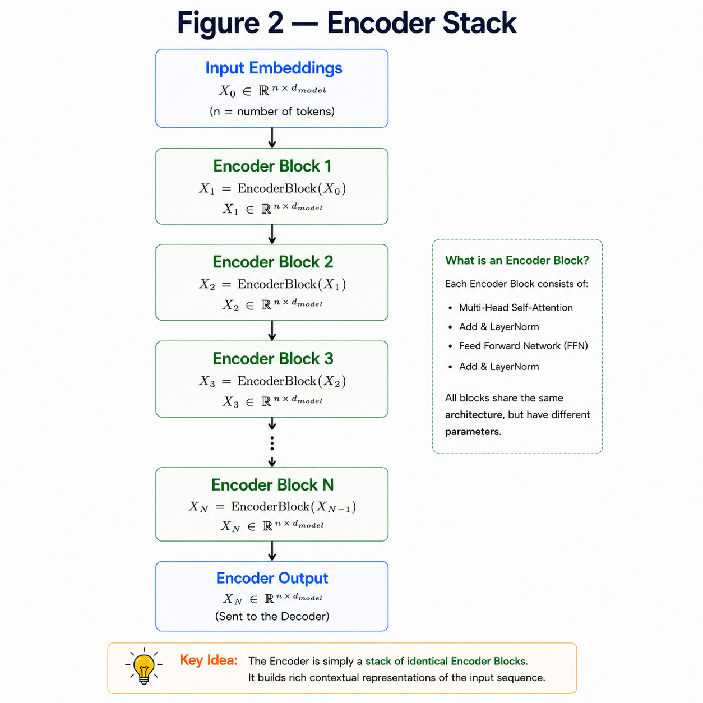
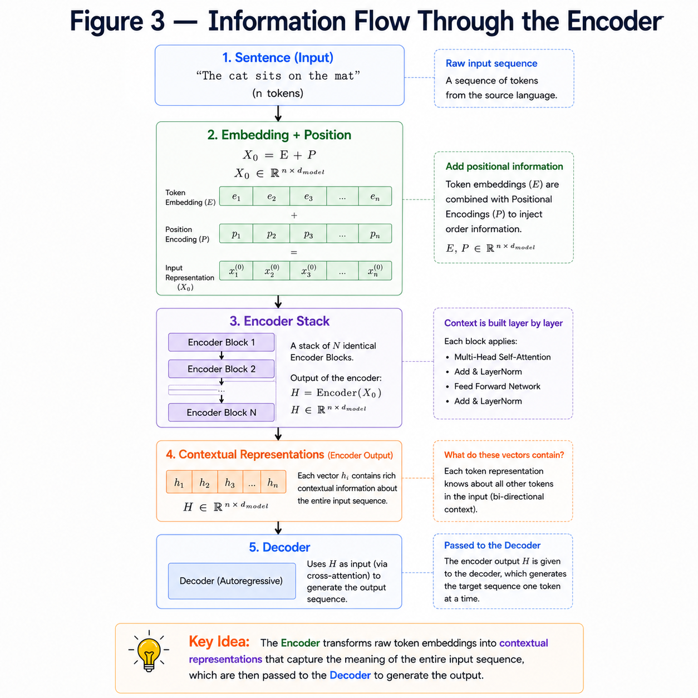

# Encoder

**"The Encoder is built by stacking identical Encoder Blocks, each refining the representation of every token."**

---

# Learning Objectives

By the end of this chapter, you will be able to:

- Understand the architecture of an Encoder Block.
- Learn how multiple Encoder Blocks form the Encoder Stack.
- Understand the data flow inside an Encoder.
- Learn the role of the Encoder in the Transformer.

---

# What is an Encoder?

The Encoder is responsible for converting the input sentence into a rich contextual representation.

It receives

- Token Embeddings
- Positional Encodings

and produces feature-rich vectors that capture the meaning of every word while considering its surrounding context.

The Decoder later uses these representations to generate the output sequence.

---

# Encoder Block

An Encoder Block combines all the components we've learned so far.

It consists of:

1. Multi-Head Attention
2. Residual Connection
3. Layer Normalization
4. Feed Forward Network
5. Residual Connection
6. Layer Normalization

Each block refines the representation of every token before passing it to the next block.

---

## ENCODER BLOCK



---

# Mathematical Representation

Given an input

$$
X
$$

the Encoder Block performs

### Step 1

Multi-Head Attention

$$
A = MHA(X)
$$

### Step 2

Residual + LayerNorm

$$
X_1 = LayerNorm(X + A)
$$

### Step 3

Feed Forward Network

$$
F = FFN(X_1)
$$

### Step 4

Residual + LayerNorm

$$
Output = LayerNorm(X_1 + F)
$$

This output becomes the input to the next Encoder Block.

---

# Numerical Flow

Suppose

```
Sequence Length = 4

Embedding Dimension = 512
```

Input Shape

$$
(4 \times 512)
$$

↓

After Multi-Head Attention

$$
(4 \times 512)
$$

↓

After Feed Forward Network

$$
(4 \times 512)
$$

Notice that the shape never changes.

Only the feature values become more informative.

---

# Encoder Stack

A single Encoder Block is useful,

but the Transformer becomes powerful by stacking multiple identical Encoder Blocks.

The original Transformer uses

```
6 Encoder Blocks
```

although modern models may use many more.

Each block receives the output of the previous block.

---

## ENCODER STACK



---

# Why Stack Multiple Blocks?

Each Encoder Block learns increasingly complex relationships.

For example,

- Early layers may learn local relationships.
- Middle layers may learn syntax.
- Deeper layers may learn semantic meaning.

Stacking multiple blocks allows the model to gradually build richer representations.

---

## INFORMATION FLOW THROUGH ENCODER



---

# Key Takeaways

- An Encoder Block combines Multi-Head Attention and FFN.
- Residual Connections and LayerNorm follow every sub-layer.
- Multiple Encoder Blocks form the Encoder Stack.
- The output shape remains unchanged.
- Each block produces richer contextual representations.

---


# Summary

The Encoder is built by stacking multiple identical Encoder Blocks.

Each block applies Multi-Head Attention followed by a Feed Forward Network, with Residual Connections and Layer Normalization ensuring stable training.

The final Encoder output captures rich contextual information for every token and serves as the input to the Decoder.

---

# What's Next?

The Encoder understands the input sequence.

Now we need a mechanism that can **generate** the output sequence one token at a time.

This is the role of the **Decoder**, which introduces two new concepts:

- Masked Multi-Head Attention
- Cross Attention

➡ **Next Chapter:** `11_Decoder.md`