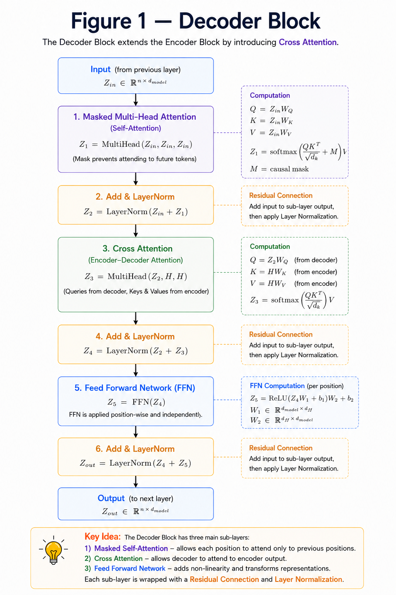
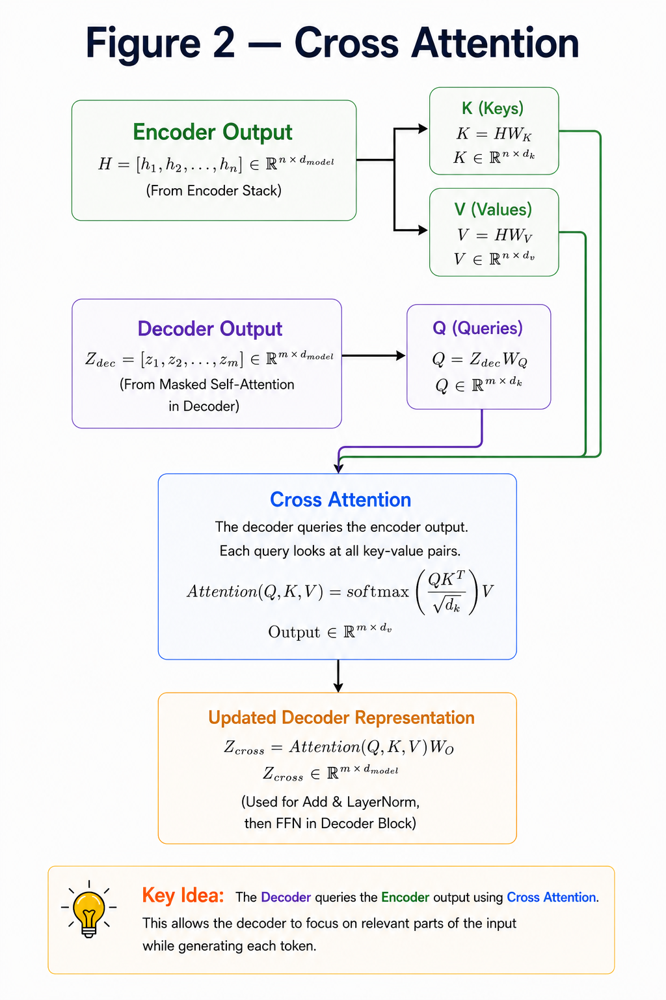
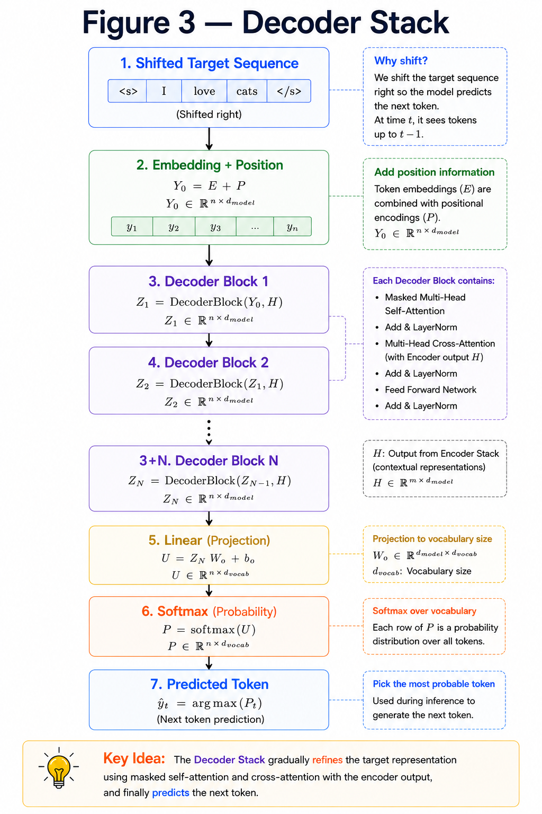

# Decoder

**"The Decoder generates the output sequence one token at a time by combining its own context with information from the Encoder."**

---

# Learning Objectives

By the end of this chapter, you will be able to:

- Understand the architecture of the Decoder Block.
- Learn why Masked Multi-Head Attention is required.
- Understand Cross Attention.
- Learn how multiple Decoder Blocks form the Decoder Stack.

---

# What is the Decoder?

The Encoder **understands** the input sentence.

The Decoder **generates** the output sentence.

Unlike the Encoder, the Decoder cannot see future words during training.

For example,

```
Input

I love AI

↓

Output

J'aime l'IA
```

When predicting

```
l'
```

the Decoder should **not** look at

```
IA
```

because that word has not been generated yet.

This is achieved using **Masked Multi-Head Attention**.

---

# Decoder Block

A Decoder Block contains three major components:

1. Masked Multi-Head Attention
2. Cross Attention
3. Feed Forward Network

Each sub-layer is followed by

- Residual Connection
- Layer Normalization

---

## DECODER BLOCK



---

# Masked Multi-Head Attention

Unlike the Encoder,

the Decoder generates one token at a time.

While predicting the next word,

it should not have access to future words.

To enforce this,

the Transformer applies a **causal mask** before Softmax.

Future positions receive

$$
-\infty
$$

which makes their attention weights zero after Softmax.

This ensures the model only attends to previously generated tokens.

---

# Cross Attention

After processing its own input,

the Decoder must also understand the Encoder output.

This is done using **Cross Attention**.

Unlike Self-Attention,

the Query comes from the Decoder,

while the Key and Value come from the Encoder.

$$
Q = Decoder
$$

$$
K = Encoder
$$

$$
V = Encoder
$$

This allows the Decoder to focus on the most relevant parts of the input sentence while generating each output token.

---

## CROSS ATTENTION EXPLAINED



---

# Decoder Stack

Just like the Encoder,

multiple Decoder Blocks are stacked together.

The output of one block becomes the input to the next.

The original Transformer uses

```
6 Decoder Blocks
```

although modern models may use many more.

---

# Shape Flow

Suppose

```
Sequence Length = 4

Embedding Dimension = 512
```

Throughout the Decoder,

the tensor shape remains

$$
(4 \times 512)
$$

Only the feature values are refined.

---

## DECODER STACK 



---

# Key Takeaways

- The Decoder generates the output sequence.
- Masked Attention prevents the model from seeing future tokens.
- Cross Attention connects the Decoder with the Encoder.
- Multiple Decoder Blocks form the Decoder Stack.
- The Decoder predicts one token at a time.

---


# Summary

The Decoder extends the Encoder architecture by introducing two new mechanisms:

- **Masked Multi-Head Attention**, which prevents information leakage from future tokens.
- **Cross Attention**, which allows the Decoder to utilize the Encoder's contextual representations.

Together, these enable the Transformer to generate output sequences one token at a time.

---

# What's Next?

We now understand every major component of the Transformer:

- Embeddings
- Positional Encoding
- Multi-Head Attention
- Feed Forward Network
- Encoder
- Decoder

The next chapter assembles these components into the **complete Transformer architecture** and follows the flow of data from input sentence to predicted output.

➡ **Next Chapter:** `12_Full_Transformer.md`