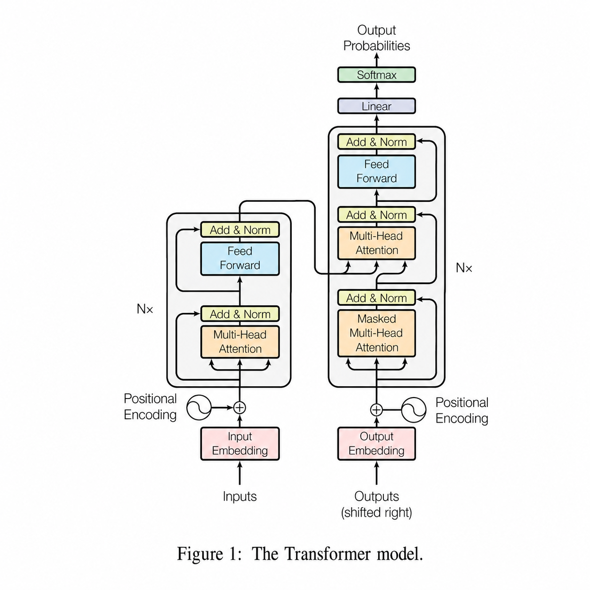
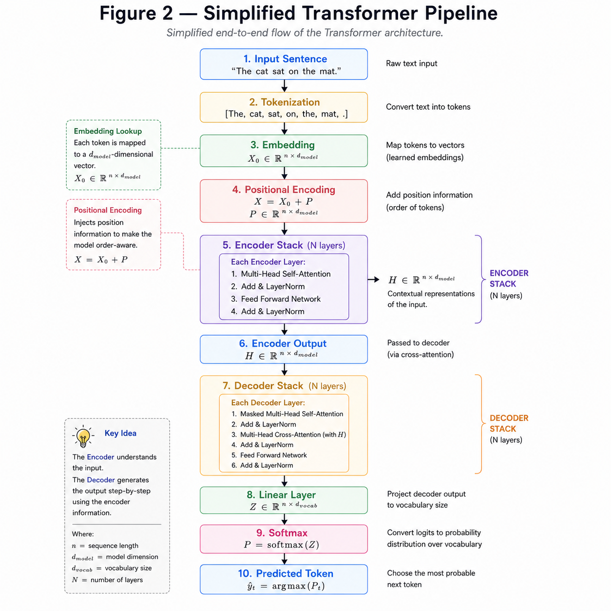

# Full Transformer Architecture

**"The Transformer combines the Encoder and Decoder into a single architecture capable of understanding an input sequence and generating an output sequence."**

---

# Learning Objectives

By the end of this chapter, you will be able to:

- Understand the complete Transformer architecture.
- Learn how data flows from input to output.
- Understand the interaction between the Encoder and Decoder.
- See how all previously learned components fit together.

---

# Putting Everything Together

So far, we have learned every building block of the Transformer:

- Embeddings
- Positional Encoding
- Multi-Head Attention
- Feed Forward Network
- Residual Connections
- Layer Normalization
- Encoder
- Decoder

Now it's time to assemble them into the complete Transformer architecture.

The Encoder processes the input sentence and produces contextual representations.

The Decoder uses these representations to generate the output sentence one token at a time.

---

## ORIGINAL TRANSFORMER ARCHITECTURE



**Attribution**

Ashish Vaswani et al.

*Attention Is All You Need.*

NeurIPS 2017.

Paper: [Attention Is All You Need](https://arxiv.org/abs/1706.03762)

---

# End-to-End Data Flow

Suppose the input sentence is

```
I love AI
```

The Transformer processes it in the following order:

1. Convert words into Token IDs.
2. Generate Embeddings.
3. Add Positional Encoding.
4. Pass through the Encoder Stack.
5. Feed the Encoder output into the Decoder.
6. Generate one output token at a time.
7. Apply a Linear layer.
8. Apply Softmax.
9. Predict the next token.

This process repeats until the complete output sentence is generated.

---

## SIMPLIFIED TRANSFORMER EXPLAINED



---

# Mathematical Overview

Given an input embedding

$$
X
$$

the Encoder computes

$$
H = Encoder(X)
$$

where

$$
H
$$

is the contextual representation.

The Decoder then computes

$$
Y = Decoder(T,H)
$$

where

- $T$ is the previously generated target sequence.
- $H$ is the Encoder output.

Finally,

$$
P = Softmax(YW+b)
$$

produces the probability distribution over the vocabulary.

The token with the highest probability is selected as the next prediction.

---

# Example

Input

```
English

I love AI
```

Encoder

```
↓

Contextual Representation
```

Decoder

```
↓

J'

↓

J'aime

↓

J'aime l'

↓

J'aime l'IA
```

Notice that the Decoder generates one token at a time while continuously using information from the Encoder.

---

# Why is the Transformer Powerful?

The Transformer combines several powerful ideas:

- Parallel processing through Self-Attention.
- Long-range dependency modeling.
- Deep feature extraction using Encoder and Decoder stacks.
- Efficient GPU utilization.
- Scalable architecture for very large language models.

These innovations enabled models such as

- BERT
- GPT
- T5
- ViT

and many modern foundation models.

---

# Key Takeaways

- The Transformer consists of an Encoder and a Decoder.
- The Encoder understands the input.
- The Decoder generates the output.
- Information flows from the Encoder to the Decoder through Cross Attention.
- The final prediction is produced using a Linear layer followed by Softmax.

---


# Summary

The Transformer combines all previously learned components into a single architecture capable of processing an input sequence and generating an output sequence.

By replacing recurrence with Attention, the Transformer achieves efficient parallel computation and captures long-range dependencies, making it the foundation of modern deep learning models.

---

# What's Next?

We now know how a Transformer performs inference.

The next question is:

> **How does it learn?**

In the next chapter, we will study the complete training pipeline, including

- Loss Function
- Backpropagation
- Gradient Descent
- Optimizer
- Training Loop

➡ **Next Chapter:** `13_Training.md`