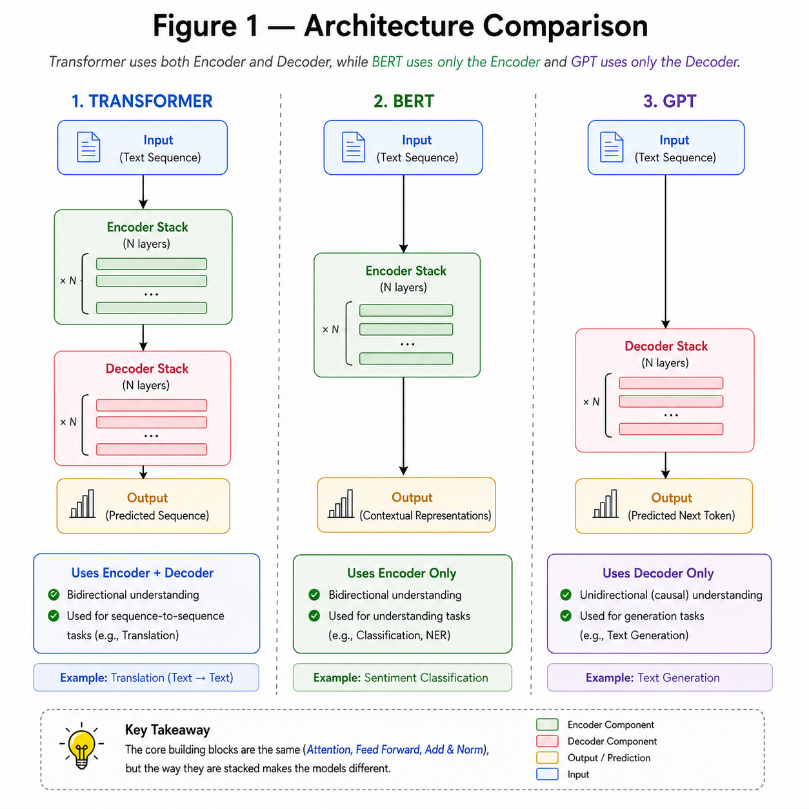
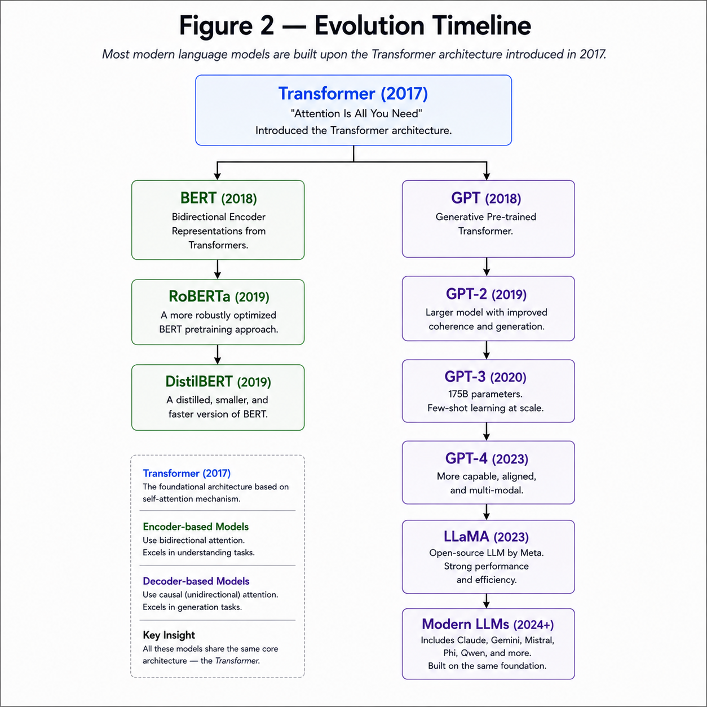

# GPT vs BERT vs Transformer

**"All modern Large Language Models are built on the Transformer architecture, but they use different parts of it depending on the task."**

---

# Learning Objectives

By the end of this chapter, you will be able to:

- Understand the difference between Transformer, BERT and GPT.
- Learn why different architectures exist.
- Know which model is suitable for different NLP tasks.
- Understand how modern LLMs evolved from the original Transformer.

---

# The Original Transformer

The original Transformer proposed in **Attention Is All You Need (2017)** consists of two parts:

- Encoder
- Decoder

The Encoder understands the input sequence, while the Decoder generates the output sequence.

It is mainly used for **sequence-to-sequence tasks** such as:

- Machine Translation
- Text Summarization
- Question Answering

---

## ARCHITECTURE COMPARISON



---

# BERT (Encoder-Only)

BERT stands for

**Bidirectional Encoder Representations from Transformers.**

It uses **only the Encoder** from the original Transformer.

Because it processes the entire sentence simultaneously,

BERT understands both left and right context.

Example

```
The bank is near the river.
```

BERT understands that

```
bank
```

refers to the side of a river,

not a financial institution,

because it considers the complete sentence.

BERT is mainly used for

- Text Classification
- Sentiment Analysis
- Named Entity Recognition
- Search
- Question Answering

---

# GPT (Decoder-Only)

GPT stands for

**Generative Pre-trained Transformer.**

It uses **only the Decoder** from the original Transformer.

Unlike BERT,

GPT predicts text **one token at a time**.

Example

```
Input

The capital of France is
```

↓

```
Paris
```

GPT is mainly used for

- Text Generation
- Chatbots
- Code Generation
- Story Writing
- Conversational AI

---

# 📊 Comparison

| Feature | Transformer | BERT | GPT |
|----------|-------------|------|-----|
| Architecture | Encoder + Decoder | Encoder Only | Decoder Only |
| Attention | Self + Cross | Self | Masked Self |
| Reads Future Tokens | Encoder: Yes | Yes | No |
| Generates Text | Yes | No | Yes |
| Bidirectional | Encoder Only | Yes | No |
| Main Use | Translation | Understanding | Generation |

---


## Best Use Cases


### Transformer

- Translation

- Summarization

- Seq2Seq


------------------


### BERT

- Classification

- QA

- Search

- NER


------------------


### GPT

- Chatbot

- Code

- Story Writing

- Content Generation


---

# Evolution of Modern LLMs

The original Transformer inspired many powerful models.

Some of the most popular are

| Model | Architecture |
|---------|-------------|
| BERT | Encoder Only |
| RoBERTa | Encoder Only |
| DistilBERT | Encoder Only |
| GPT-2 | Decoder Only |
| GPT-3 | Decoder Only |
| GPT-4 | Decoder Only |
| LLaMA | Decoder Only |
| Mistral | Decoder Only |
| T5 | Encoder + Decoder |
| FLAN-T5 | Encoder + Decoder |

Although these models differ in architecture and scale,

they all trace their origins back to the Transformer introduced in 2017.

---

## EVOLUTION TIMELINE



---

# Key Takeaways

- Transformer consists of both Encoder and Decoder.
- BERT uses only the Encoder.
- GPT uses only the Decoder.
- Encoder models are excellent for language understanding.
- Decoder models are excellent for text generation.
- The original Transformer remains the foundation of modern LLMs.

---


# Summary

The original Transformer introduced the Encoder–Decoder architecture, laying the foundation for modern Natural Language Processing.

BERT adapted the Encoder for language understanding tasks, while GPT adopted the Decoder for autoregressive text generation.

Although their architectures differ, they all share the same fundamental building blocks introduced in the Transformer paper.

---

# Conclusion

You have now completed the theory behind the Transformer architecture.

You understand:

- Embeddings
- Positional Encoding
- Attention
- Scaled Dot-Product Attention
- Multi-Head Attention
- Residual Connections
- Layer Normalization
- Feed Forward Networks
- Encoder
- Decoder
- Full Transformer
- Training Pipeline
- GPT vs BERT vs Transformer

The next step is to implement every one of these components **from scratch using only NumPy**.
